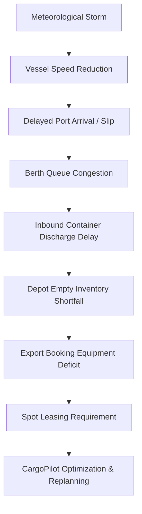
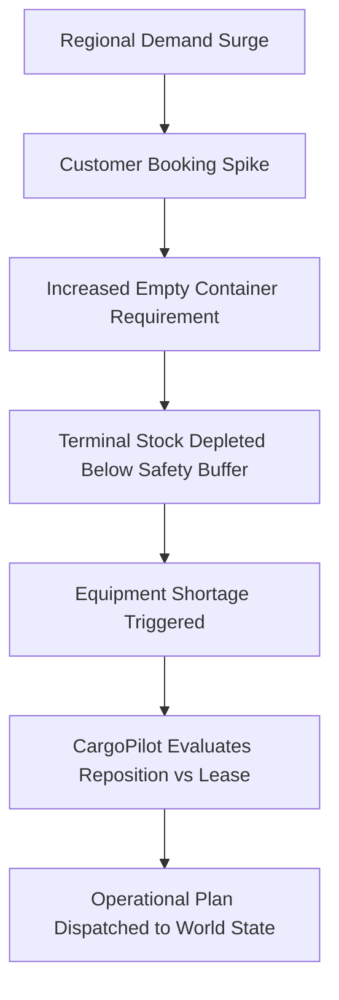
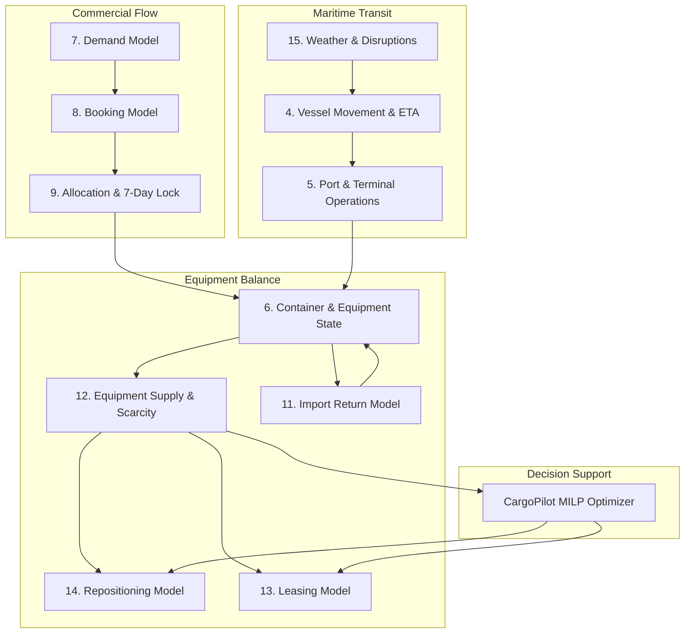

# CargoPilot Simulation Models & Mathematical Specification

> **Document:** Doc 2 — Simulation Models & Mathematical Specification  
> **Version:** V0.1 — Working Draft  
> **Status:** Under Development  
> **Depends On:** Doc 1 — Simulation Engine Architecture & Behavioral Specification  

---

## Table of Contents

1. [Modeling Philosophy & Mathematical Framework](#1-modeling-philosophy--mathematical-framework)
2. [Simulation Time & Event-Time Calculations](#2-simulation-time--event-time-calculations)
3. [Randomness & Probability Framework](#3-randomness--probability-framework)
4. [Vessel & Voyage Model](#4-vessel--voyage-model)
5. [Port & Terminal Model](#5-port--terminal-model)
6. [Container & Equipment Model](#6-container--equipment-model)
7. [Demand Model](#7-demand-model)
8. [Booking Generation Model](#8-booking-generation-model)
9. [Allocation & 7-Day Lock Model](#9-allocation--7-day-lock-model)
10. [Empty Container Flow Model](#10-empty-container-flow-model)
11. [Import Return Model](#11-import-return-model)
12. [Equipment Supply & Scarcity Model](#12-equipment-supply--scarcity-model)
13. [Leasing Model](#13-leasing-model)
14. [Repositioning Model](#14-repositioning-model)
15. [Disruption Models](#15-disruption-models)
16. [Causal & Cascading Effects](#16-causal--cascading-effects)
17. [Forecasting Model](#17-forecasting-model)
18. [Information / Visibility Model](#18-information--visibility-model)
19. [Operational Timeline Model](#19-operational-timeline-model)
20. [Failure & Exception Models](#20-failure--exception-models)
21. [Recovery Models](#21-recovery-models)
22. [Backlog Model](#22-backlog-model)
23. [Cost Models](#23-cost-models)
24. [Scenario Models](#24-scenario-models)
25. [Parameters & Configuration](#25-parameters--configuration)
26. [Calibration & Realism](#26-calibration--realism)
27. [Validation](#27-validation)
28. [Mathematical Notation / Formula Registry](#28-mathematical-notation--formula-registry)
29. [Model Dependency Map](#29-model-dependency-map)
30. [V1 vs Future Models](#30-v1-vs-future-models)
31. [Final Modeling Principle](#final-modeling-principle)

---

## 1. Modeling Philosophy & Mathematical Framework

### 1.1 Purpose
Doc 2 defines the mathematical, probabilistic, behavioral, and state-transition models used by the CargoPilot Simulation Engine.

- **Doc 1 defines:** What exists, how the system is structured, what happens, when it happens, and how components interact.
- **Doc 2 defines:** How the individual behaviors and transitions are calculated.

#### Behavioral Mapping Examples

```text
DOC 1: Vessel can be delayed by weather
   ↓
DOC 2: Weather impact → delay probability / speed reduction factor

DOC 1: Port congestion affects vessel operations
   ↓
DOC 2: Port utilization → congestion index → handling & waiting time penalty

DOC 1: Demand generates bookings
   ↓
DOC 2: Demand stochastic process → booking generation arrival probability
```

This structural separation is explicitly established by Doc 1.

### 1.2 Core Modeling Principle
The simulator must produce **operational logistics realism**, rather than low-level physical-world simulation.

#### Scope Included in V1:
- Vessel movement & transit progression
- Voyage schedule tracking & delay propagation
- Port operations, queues, & berth handling
- Container lifecycle & inventory state transitions
- Booking generation & commercial demand arrival
- Equipment availability, shortages, & surplus tracking
- One-way and master leasing operational execution
- Empty container repositioning execution
- Operational disruptions & weather delays
- Equipment/vessel mechanical failures & recovery
- Operational cost calculations & KPI recording

#### Scope Explicitly Excluded from V1:
- Detailed ship hydrodynamics & wave drag
- Engine thermodynamics & fuel combustion curves
- Detailed ocean physics & 3D fluid dynamics
- Exact meteorological weather forecasting
- Low-level container crane kinematics & mechanical stress
- Individual terminal worker behaviors & shift psychology
- Full terminal 3D digital-twin physics

### 1.3 World-State Representation
Let $S(t)$ represent the complete operational simulation state at simulation time $t$:

$$S(t) = \{ P(t), V(t), Y(t), C(t), B(t), D(t), E(t), L(t), A(t), R(t) \}$$

Where:
- $P(t)$: Port operational states (berths, yards, queues)
- $V(t)$: Vessel fleet states (positions, loads, speeds)
- $Y(t)$: Voyage schedules and leg progression
- $C(t)$: Container equipment inventory and individual unit tracking
- $B(t)$: Booking orders and customer fulfillment states
- $D(t)$: Realized and forecasted cargo demand
- $E(t)$: Equipment supply and availability breakdown per location
- $L(t)$: Active leasing agreements and leased equipment pools
- $A(t)$: Allocation states and 7-day commitment locks
- $R(t)$: Active disruptions, weather events, and scenario overrides

*Note: The exact decomposition may evolve as individual sub-models are finalized.*

### 1.4 State Transition
A simulation event or discrete model execution transforms the world state according to:

$$S(t^+) = F\bigl(S(t^-), E, \theta, \omega\bigr)$$

Where:
- $S(t^-)$: State immediately before the event occurs
- $S(t^+)$: State immediately after event execution
- $E$: Ingested event payload
- $\theta$: Configured model parameters
- $\omega$: Stochastic outcome drawn from configured probability distributions
- $F$: State-transition logic for the applicable domain component

> [!IMPORTANT]
> The simulator must **never** independently regenerate the world state for each time step. Each advancement begins strictly from the latest valid state $S(t^-)$ and propagates all cumulative operational consequences forward.

### 1.5 Configurable Model Parameters
Any behavior that may reasonably require operational tuning, scenario control, experimentation, or calibration must be represented by an **explicitly named configuration parameter** rather than a hardcoded literal.

Every model $m$ exposes a parameter set:

$$\Theta_m = \{ \theta_1, \theta_2, \ldots, \theta_n \}$$

**Examples:**
- `VESSEL_BASE_SPEED_KNOTS`
- `VESSEL_SPEED_VARIATION`
- `PORT_BERTH_COUNT`
- `PORT_LOADING_RATE`
- `PORT_DISCHARGE_RATE`
- `DEMAND_MEAN`
- `DEMAND_VARIANCE`
- `LEASE_COST_PER_DAY`
- `STORM_PROBABILITY`

### 1.6 Parameter Classification

| Type | Admin Controlled | Example | Description |
| :--- | :---: | :--- | :--- |
| **Simulation parameter** | Yes | `SIMULATION_START_TIME` | Global simulation clock baseline and bounds |
| **Scenario parameter** | Yes | `STORM_PROBABILITY` | Experiment/scenario disruption toggles |
| **Operational parameter** | Yes | `PORT_LOADING_RATE` | Physical infrastructure throughput rates |
| **Business parameter** | Yes | `LEASE_COST_PER_DAY` | Financial contracts and commercial penalties |
| **Calibration parameter** | Yes | `VESSEL_DELAY_FACTOR` | Tuning scalar to fit historical real-world data |
| **Mathematical constant** | No | Unit conversion factors | Fixed constants (e.g., $24\text{ hours/day}$) |
| **Runtime state** | No | `VESSEL_CURRENT_POSITION` | Evolving state variables of active entities |
| **Derived value** | No | `VESSEL_ETA` | Computed from distance, speed, and delays |

Admin-editable parameters must specify:
- Parameter name (UPPER_SNAKE_CASE)
- Description & operational context
- Current value & default value
- Measurement unit (knots, TEU, USD/day, hours, etc.)
- Minimum & maximum bounds
- Allowed discrete options (if enum) or distribution family (if stochastic)
- Editable status & model dependencies

### 1.7 General Model Structure
Every simulation model component conforms to the following input-output pipeline:

```text
┌─────────────────────────────────────────────────────────┐
│                      INPUT STATE                        │
│                           +                             │
│                CONFIGURATION PARAMETERS                 │
│                           +                             │
│               EVENTS / EXTERNAL CONDITIONS              │
│                           +                             │
│                     RANDOM OUTCOME                      │
└───────────────────────────┬─────────────────────────────┘
                            │
                            ▼
                    ┌──────────────┐
                    │ MODEL LOGIC  │
                    └───────┬──────┘
                            │
                            ▼
┌─────────────────────────────────────────────────────────┐
│                     STATE CHANGES                       │
│                           +                             │
│                   GENERATED EVENTS                      │
│                           +                             │
│                DOWNSTREAM CONSEQUENCES                  │
└─────────────────────────────────────────────────────────┘
```

---

## 2. Simulation Time & Event-Time Calculations

### 2.1 Simulation Clock
Simulation time is independent of real-world wall clock time. The simulation engine maintains one authoritative discrete clock:

$$T_{\text{sim}}$$

**Example:**
- Current: `2026-09-05 00:00`
- Next Day: `2026-09-06 00:00`

### 2.2 Time Advancement
For an advancement request from current time $T_{\text{current}}$ to target time $T_{\text{target}}$:

$$T_{\text{target}} = T_{\text{current}} + \Delta t$$

In V1, single-step increments satisfy:

$$0 < \Delta t \le 24\text{ hours}$$

Supported discrete UI step controls include:
- `+1 hour`
- `+6 hours`
- `+12 hours`
- `+24 hours` (1 Day)

Advancements spanning multi-week horizons are executed via sequential discrete advancements.

### 2.3 Event-Time Execution
For any time advancement over interval $[T_0, T_1]$, the engine processes all scheduled and triggered events in strictly chronological order:

```text
T₀ ──► [Event 1] ──► [Event 2] ──► [Event 3] ──► [Event 4] ──► T₁
```

The simulator **does not** compute a naive delta between $T_0$ and $T_1$; it executes the discrete sequence of events, ensuring complete causal validity.

### 2.4 Persistent State & Consequences
Past events are never re-executed. Their side-effects become integral components of the active world state:

- **Past:** Inmutable history of executed events and persisted outcomes.
- **Current:** Instantaneous operational reality $S(t)$.
- **Future:** Queued event schedule and predicted milestones.

> **Example:** A severe storm occurs between Day 11 06:00 and Day 12 18:00 causing an 8-hour vessel delay. After Day 12 18:00, the storm disruption ends, but the vessel's 8-hour schedule delay persists in $S(t)$ and cascades into subsequent port handling and cargo arrival.

### 2.5 SimPy Orchestration Role
- **SimPy Engine:** Manages the simulation timeline, discrete process workers, timeout schedules, priority queues, and event triggers (*"When should it happen?"*).
- **Domain Model:** Governs shipping rules, network balances, container logistics, and optimization policies (*"What should happen?"*).

---

## 3. Randomness & Probability Framework

### 3.1 Purpose & Reproducibility
Stochastic variation models operational uncertainty (demand fluctuations, transit delays, equipment breakdowns, weather shocks). All randomness must support deterministic reproduction.

### 3.2 Simulation Seed
Every simulation run is governed by a global integer seed:

$$\text{Seed} \in \mathbb{Z}^+$$

Guarantee:

$$\text{InitialState} + \text{Scenario} + \text{Configuration} + \text{Seed} \implies \text{Identical Trajectory}$$

### 3.3 Causal vs. Arbitrary Randomness
Randomness represents real-world uncertainty, not arbitrary noise:

- ❌ **Anti-pattern:** Randomly adjusting port container stock every day.
- ✅ **Causal pattern:** Demand spike $\rightarrow$ increased booking volume $\rightarrow$ higher empty pickup rate $\rightarrow$ depot container inventory depletion $\rightarrow$ equipment shortage.

### 3.4 Supported Distributions
- **Bernoulli / Binomial:** Vessel delay occurrence, booking cancellations, container damage probability.
- **Poisson:** Hourly/daily booking and customer return arrival rates.
- **Normal / Log-Normal:** Travel times, voyage durations, terminal crane handling speeds.
- **Uniform:** Lead-time intervals, random inspection sampling.
- **Exponential / Gamma:** Time-between-failures (MTBF) and repair duration.

### 3.5 Stochastic Parameter Variables
Each stochastic model component registers standardized parameters:
- `MODEL_EVENT_PROBABILITY`
- `MODEL_MEAN`
- `MODEL_STANDARD_DEVIATION`
- `MODEL_MIN` / `MODEL_MAX`
- `MODEL_RATE`
- `MODEL_SEED`

---

## 4. Vessel & Voyage Model

### 4.1 Vessel Entity
Represents an individual physical container ship. Core state includes:
- `vessel_id`: Unique identifier
- `name`: Vessel label
- `capacity_teu`: Maximum nominal container capacity in TEU
- `current_location`: Coordinate / Port UN/LOCODE
- `current_voyage_id`: Active voyage reference
- `destination_port`: Target arrival port
- `status`: `IN_TRANSIT` | `ARRIVED` | `BERTHED` | `WORKING` | `WAITING_FOR_BERTH` | `ANCHORED`
- `current_speed_knots`: Real-time operational speed
- `schedule_variance_hours`: Deviation from planned schedule ($+$ delay / $-$ ahead)
- `current_load_teu`: Total TEU currently loaded on board

### 4.2 Voyage Entity
Represents a scheduled commercial transit between network ports:
- `voyage_id`: Unique voyage code
- `vessel_id`: Assigned vessel
- `origin_port` & `destination_port`: Leg boundary UN/LOCODEs
- `scheduled_departure` & `scheduled_arrival`: Published schedule
- `actual_departure` & `estimated_arrival`: Real-time tracking values
- `status`: `SCHEDULED` | `ACTIVE` | `COMPLETED` | `CANCELLED`

### 4.3 Vessel Movement & Transit Time
For a voyage leg with nautical distance $D$ and effective speed $V_{\text{eff}}$:

$$T_{\text{travel}} = \frac{D}{V_{\text{eff}}}$$

Where effective vessel speed accounts for weather and operational factors:

$$V_{\text{eff}} = V_{\text{base}} \times F_{\text{weather}} \times F_{\text{operational}}$$

- $V_{\text{base}}$: Design cruising speed (knots)
- $F_{\text{weather}} \in (0, 1]$: Speed reduction penalty due to sea state / headwinds
- $F_{\text{operational}} \in (0, 1]$: Slow-steaming or efficiency constraints

### 4.4 Continuous Position Tracking
A vessel retains its active position along its transit leg:

$$\text{Position}_{\text{current}} = \text{Position}_{\text{origin}} + \vec{u} \cdot \int_{t_{\text{dep}}}^{t} V_{\text{eff}}(\tau)\, d\tau$$

Calculations never re-baseline to the origin port after an intermediate simulation step.

### 4.5 Weather Impact
Weather systems degrade vessel speed and trigger potential schedule slips:

$$V_{\text{weather}} = V_{\text{base}} \times F_{\text{weather}}$$

Associated parameters:
- `VESSEL_BASE_SPEED_KNOTS`
- `VESSEL_SPEED_VARIATION`
- `WEATHER_SPEED_FACTOR`
- `WEATHER_DELAY_PROBABILITY`
- `WEATHER_DELAY_MIN_HOURS`
- `WEATHER_DELAY_MAX_HOURS`

### 4.6 Arrival & Port Entry Sequence
Upon reaching the target port destination radius:

```text
[IN_TRANSIT] ──► [ARRIVED] ──► [Port Resource Check]
                                      │
              ┌───────────────────────┴───────────────────────┐
              ▼                                               ▼
     Berth Available                                  Berth Congested
              │                                               │
              ▼                                               ▼
          [BERTHED]                                  [WAITING_FOR_BERTH]
              │                                               │
              ▼                                               ▼
      Discharge/Loading                              Queue Time Accumulation
```

### 4.7 Waiting & Congestion Delay
If all berths are occupied, the vessel transitions to `WAITING_FOR_BERTH`. The accumulated queue time directly increases the vessel's `schedule_variance_hours`.

### 4.8 Voyage Generation & Planning Horizon
- The simulator generates and maintains recurring service loops covering up to a **90-day forward operational window**.
- CargoPilot's planning engine only ingests events within its authorized decision horizon (preventing future information leakage).

### 4.9 Vessel Model Parameters
- `VESSEL_BASE_SPEED_KNOTS`
- `VESSEL_SPEED_VARIATION`
- `VESSEL_CAPACITY_TEU`
- `VESSEL_TURNAROUND_TIME`
- `VESSEL_DELAY_PROBABILITY`
- `VESSEL_MECHANICAL_FAILURE_PROBABILITY`
- `VESSEL_MEAN_TIME_BETWEEN_FAILURES`
- `VESSEL_RECOVERY_TIME`

---

## 5. Port & Terminal Model

### 5.1 Port State Structure
A port terminal node consists of:

```text
Port / Terminal
├── Berths (Dedicated & multi-user container vessel berths)
├── Cranes (Ship-to-shore gantry cranes)
├── Container Yard (CY storage capacity & stacking zones)
├── Vessel Waiting Queue (Anchorage FIFO / priority queue)
├── Container Inventory (Full import, full export, empty stocks by type)
├── Handling Capacity (Gross crane moves per hour)
└── Congestion State (Dynamic utilization index)
```

### 5.2 Berth Capacity Constraint
Let $B_{\text{available}}(t)$ represent the number of free berths at time $t$:

$$B_{\text{available}}(t) = B_{\text{total}} - \sum_{v \in \text{Vessels}} \mathbf{1}_{\{ \text{status}(v, t) = \text{BERTHED} \}}$$

Vessel berthing operations are constrained by:

$$B_{\text{available}}(t) > 0$$

### 5.3 Yard Storage Capacity Constraint
At all simulation times $t$:

$$\text{YardOccupancy}(t) \le \text{YardCapacity}$$

Where $\text{YardOccupancy}(t)$ is the aggregate sum of all physical containers residing in the port terminal.

### 5.4 Port Utilization Index
The port utilization metric $U(t)$ is defined as:

$$U(t) = \frac{\text{ResourceUsage}(t)}{\text{ResourceCapacity}(t)}$$

Evaluated across both berth availability and yard storage buffers.

### 5.5 Congestion Function
When utilization exceeds critical threshold $U_{\text{threshold}}$:

$$\text{Congestion}(t) = f\bigl(U(t)\bigr) = \max\left(0,\, \frac{U(t) - U_{\text{threshold}}}{1 - U_{\text{threshold}}}\right)$$

Higher congestion exponentially increases vessel waiting times and slows terminal crane moves per hour.

**Port Parameters:**
- `PORT_BERTH_COUNT`
- `PORT_CRANE_COUNT`
- `PORT_YARD_CAPACITY`
- `PORT_LOADING_RATE` (moves/hour)
- `PORT_DISCHARGE_RATE` (moves/hour)
- `PORT_BASE_HANDLING_TIME`
- `PORT_CONGESTION_THRESHOLD`
- `PORT_CONGESTION_FACTOR`

---

## 6. Container & Equipment Model

### 6.1 Container Entity
The fundamental physical asset tracked across the supply chain:
- `container_id`: ISO 6346 identification number (e.g., `MSCU1234567`)
- `equipment_type`: Standard size/type designation
- `current_location`: Port, depot, customer premise, or vessel ID
- `status`: Physical lifecycle state
- `condition`: `GOOD` | `DAMAGED` | `MAINTENANCE` | `UNAVAILABLE`
- `booking_id`: Associated booking assignment (if allocated)
- `ownership`: `OWNED` | `LONG_TERM_LEASE` | `SPOT_LEASE`

### 6.2 Container Lifecycle State Machine

```text
[EMPTY_AVAILABLE] ──► [ALLOCATED] ──► [GATE_OUT / PICKUP] ──► [STUFFING]
                                                                  │
[AVAILABLE] ◄── [DISCHARGE] ◄── [IN_TRANSIT] ◄── [LOADED] ◄───────┘
```

### 6.3 Supported Equipment Types
- `20DC`: 20ft Standard Dry Container (1.0 TEU)
- `40DC`: 40ft Standard Dry Container (2.0 TEU)
- `40HC`: 40ft High Cube Dry Container (2.0 TEU)

### 6.4 Maintenance & Condition Transition
Containers transition to `DAMAGED` or `MAINTENANCE` states based on operational handling events (rough transit, terminal drop, customer abuse):

$$\mathbb{P}(\text{Damaged} \mid \text{Handling Event}) = \theta_{\text{damage}}$$

**Parameters:**
- `CONTAINER_DAMAGE_PROBABILITY`
- `CONTAINER_DAMAGE_SEVERITY`
- `CONTAINER_REPAIR_TIME` (days)
- `CONTAINER_MAINTENANCE_PROBABILITY`

---

## 7. Demand Model

### 7.1 Demand Generation Purpose
Simulates customer shipping demand across origin-destination port pairs, establishing the commercial cargo flow driving the logistics network.

### 7.2 Demand Dimensionality
Demand is partitioned along:

$$D_{i, j, e, t}$$

- Origin port $i$
- Destination port $j$
- Equipment type $e \in \{ \text{20DC}, \text{40DC}, \text{40HC} \}$
- Target departure window / week $t$

### 7.3 Demand Decomposition
Total realized customer demand decomposes into:

$$D_t = D_{\text{base}, t} + D_{\text{seasonal}, t} + D_{\text{trend}, t} + D_{\text{variation}, t} + D_{\text{shock}, t}$$

- $D_{\text{base}}$: Baseline weekly container volume
- $D_{\text{seasonal}}$: Cyclical seasonal curve (e.g., pre-holiday surge)
- $D_{\text{trend}}$: Macro trade growth or contraction
- $D_{\text{variation}} \sim \mathcal{N}(0, \sigma^2)$: Stochastic variance
- $D_{\text{shock}}$: Scenario disruption surges or sudden route cancellations

**Parameters:**
- `DEMAND_BASE_RATE`
- `DEMAND_GROWTH_RATE`
- `DEMAND_SEASONAL_FACTOR`
- `DEMAND_VARIANCE`
- `DEMAND_SPIKE_PROBABILITY`
- `DEMAND_SPIKE_FACTOR`

---

## 8. Booking Generation Model

### 8.1 Booking Creation Flow
Realized demand is converted into discrete customer booking requests:

```text
[Demand Process] ──► [Booking Generation] ──► [BOOKING_CREATED Event]
                                                      │
                                                      ▼
                                              [Kafka Message Bus]
                                                      │
                                                      ▼
                                            [CargoPilot Ingestion]
```

### 8.2 Booking Attributes
- `booking_id`: Unique booking reference number
- `origin_port` & `destination_port`: Trade route ports
- `commodity`: Cargo type description
- `equipment_type`: Requested container type
- `quantity`: Number of containers required
- `requested_departure_date`: Earliest viable departure
- `status`: `SUBMITTED` | `CONFIRMED` | `ALLOCATED` | `CANCELLED` | `FULFILLED`
- `lock_status`: `UNLOCKED` | `LOCKED`

### 8.3 Booking Arrival Probability
Individual booking orders arrive according to a Poisson arrival process parameterized by demand volume:

$$\mathbb{P}(k \text{ bookings in interval } \Delta t) = \frac{(\lambda \Delta t)^k e^{-\lambda \Delta t}}{k!}$$

### 8.4 Booking Lifecycle & Modifications
Bookings can be confirmed, modified, or cancelled prior to departure cutoffs:
- `BOOKING_GENERATION_RATE`
- `BOOKING_CANCELLATION_PROBABILITY`
- `BOOKING_MODIFICATION_PROBABILITY`
- `BOOKING_LEAD_TIME` (days before departure)

---

## 9. Allocation & 7-Day Lock Model

### 9.1 Boundary of Responsibility
- **CargoPilot Decision Engine:** Owns optimization, container allocation recommendations, and empty equipment repositioning assignments.
- **Simulation Engine:** Owns operational execution, enforces physical feasibility, advances time, and records the resulting state changes.

### 9.2 Allocation Lifecycle States

```text
[CREATED] ──► [ALLOCATED] ──► [MODIFIABLE] ──► [LOCKED (at Cutoff)] ──► [COMPLETED]
```

### 9.3 Seven-Day Freeze Boundary
For a booking with scheduled vessel departure $T_{\text{departure}}$:

$$T_{\text{cutoff}} = T_{\text{departure}} - 7\text{ days}$$

- **Before $T_{\text{cutoff}}$:** Allocations remain dynamic and may be freely re-optimized by CargoPilot.
- **At & After $T_{\text{cutoff}}$:** The allocation freezes into a hard operational lock:

$$\text{Allocation}_{t+1} = \text{Allocation}_t$$

### 9.4 Lock Enforcement
Standard planning workflows cannot modify a locked allocation. Only authorized administrator emergency overrides may break a locked assignment.

### 9.5 Admin Override Protocol
When an administrator forces an operational reassignment:

```text
[Admin Override Request] ──► [CargoPilot API Validation] ──► [World State Mutation]
                                                                     │
                                                                     ▼
                                                        [Simulation Observes Change]
```

---

## 10. Empty Container Flow Model

### 10.1 Operational Flow
Empty containers must be available at depot locations to service outward booking demand:

```text
[EMPTY_DEPOT] ──► [AVAILABLE] ──► [ALLOCATED] ──► [GATE_OUT / PICKUP]
                                                         │
[AVAILABLE] ◄── [DEPOT_RETURN] ◄── [STRIPPED] ◄── [CUSTOMER_UNLOAD]
```

### 10.2 Empty Stock Tracking
For port/depot location $l$ and equipment type $e$:

$$\text{EmptyInventory}_{l, e}(t)$$

Is modified by:
- Inbound empty repositioning discharges ($+$)
- Import container empty returns ($+$)
- Off-hire redeliveries to leasing companies ($-$)
- Outbound empty repositioning loadings ($-$)
- Outbound export booking pickups ($-$)
- Damage / maintenance removals ($-$)

### 10.3 Equipment Balance Conservation
For every discrete step:

$$\text{Inventory}_{t+1} = \text{Inventory}_t + \text{Inflow}_t - \text{Outflow}_t$$

Equipment can neither disappear nor spontaneously generate without an explicit transaction event.

---

## 11. Import Return Model

### 11.1 Import Stripping & Return Cycle
Inbound full containers discharged from vessels are trucked to consignees, stripped of cargo, and returned to empty depots:

```text
[Full Inbound Cargo] ──► [Vessel Discharge] ──► [Consignee Delivery]
                                                        │
                                                        ▼
[Available Empty Depot Stock] ◄── [Empty Return Gate-In] ◄── [Customer Unstuffing]
```

### 11.2 Customer Turnaround Time
Customer detention duration follows a stochastic distribution:

$$T_{\text{return}} = T_{\text{delivery}} + T_{\text{customer\_use}}$$

Where $T_{\text{customer\_use}}$ is drawn from a log-normal or gamma distribution:
- `IMPORT_RETURN_MEAN_DAYS` (default: 5.0 days)
- `IMPORT_RETURN_VARIANCE`
- `IMPORT_RETURN_MIN_DAYS` (default: 1.0 day)
- `IMPORT_RETURN_MAX_DAYS` (default: 21.0 days)
- `IMPORT_RETURN_DELAY_PROBABILITY`

---

## 12. Equipment Supply & Scarcity Model

### 12.1 Supply-Demand Balance
At any port $l$, equipment availability vs. outward demand determines market balance:

$$\text{NetSupply}_{l, e}(t) = \text{AvailableEquipment}_{l, e}(t) - \text{CommittedDemand}_{l, e}(t)$$

### 12.2 Shortage Condition
An equipment shortage event is triggered whenever:

$$\text{AvailableEquipment}_{l, e}(t) < \text{RequiredEquipment}_{l, e}(t)$$

$$\text{ShortageQuantity}_{l, e}(t) = \max\bigl(0,\, \text{RequiredEquipment}_{l, e}(t) - \text{AvailableEquipment}_{l, e}(t)\bigr)$$

### 12.3 Scarcity Severity Index
The equipment scarcity ratio gauges regional operational risk:

$$\text{ScarcityRatio}_{l, e}(t) = \frac{\text{RequiredEquipment}_{l, e}(t)}{\max\bigl(1,\, \text{AvailableEquipment}_{l, e}(t)\bigr)}$$

- $\text{ScarcityRatio} \le 1.0$: Safe buffer / surplus
- $1.0 < \text{ScarcityRatio} \le 1.25$: Tight inventory warning
- $\text{ScarcityRatio} > 1.25$: Critical deficit risk; requires immediate repositioning or leasing

**Parameters:**
- `EQUIPMENT_INITIAL_INVENTORY`
- `EQUIPMENT_MINIMUM_BUFFER`
- `EQUIPMENT_SHORTAGE_THRESHOLD`
- `EQUIPMENT_DAMAGE_RATE`
- `EQUIPMENT_REPAIR_RATE`

---

## 13. Leasing Model

### 13.1 Purpose & Role
Models supplemental container procurement via third-party container leasing companies to mitigate structural equipment deficits:
- Master leasing (long-term flexible pool)
- One-way spot leasing (direct repositioning assistance)

### 13.2 Lease Procurement Calculation
When local owned stocks cannot fulfill confirmed bookings:

$$\text{LeaseRequirement} = \max\bigl(0,\, \text{RequiredEquipment} - \text{AvailableOwnedEquipment}\bigr)$$

### 13.3 Financial Cost Formulation
For leased volume $Q$ of equipment type $e$:

$$\text{LeaseCost} = Q \times \text{DailyLeaseRate}_e \times \text{DurationDays} + Q \times \text{PickupCharge}_e + Q \times \text{DropoffCharge}_e$$

**Parameters:**
- `LEASE_COST_PER_DAY` (USD/TEU/day)
- `LEASE_MIN_DURATION` (days)
- `LEASE_MAX_DURATION` (days)
- `LEASE_AVAILABLE_CAPACITY` (max leasable units per location)
- `LEASE_START_DELAY` (lead time to pickup)
- `LEASE_COST_VARIATION`

---

## 14. Repositioning Model

### 14.1 Operational Repositioning Mechanism
Moves empty equipment from surplus ports (where imports exceed exports) to deficit ports (where exports exceed imports):

```text
[Surplus Location A] ──► [Load Empties on Vessel] ──► [Voyage Leg Transit]
                                                              │
[Deficit Location B] ◄── [Discharge Empties to CY] ◄──────────┘
```

### 14.2 Regional Imbalance Classification
For any port location $l$:

$$\text{Surplus}_l = \max\bigl(0,\, \text{Available}_l - \text{TargetSafetyStock}_l\bigr)$$

$$\text{Deficit}_l = \max\bigl(0,\, \text{TargetSafetyStock}_l - \text{Available}_l\bigr)$$

### 14.3 Division of Responsibilities
- **CargoPilot MILP Solver:** Calculates optimal repositioning decisions (quantity, container type, vessel voyage leg).
- **Simulation Engine:** Validates vessel TEU weight/slot limits, deducts empties from origin port CY, moves them through maritime transit, and credits destination inventory upon vessel discharge.

**Parameters:**
- `REPOSITIONING_TRANSIT_TIME`
- `REPOSITIONING_HANDLING_TIME`
- `REPOSITIONING_COST_PER_TEU`
- `REPOSITIONING_CAPACITY_LIMIT`

---

## 15. Disruption Models

### 15.1 Disruption Taxonomy
Operational shocks modeled by the engine:
1. **Severe Weather / Storms:** Gale winds, typhoons, sea swells causing speed reductions and port closures.
2. **Port Congestion:** Terminal yard saturation, crane breakdowns, and vessel queue spikes.
3. **Labor Strikes / Work Stoppages:** Temporary cessation of terminal handling operations.
4. **Vessel Mechanical Failure:** Engine breakdown forcing slow steaming or emergency anchorage repairs.
5. **Equipment Shortage Shocks:** Sudden localized equipment shortfalls.
6. **Demand Volatility Spikes:** Unexpected surges in regional export bookings.

### 15.2 Disruption Data Schema
```text
Disruption
├── disruption_id: Unique GUID
├── type: STORM | CONGESTION | STRIKE | MECHANICAL_FAILURE | DEMAND_SPIKE
├── start_time: ISO-8601 simulation timestamp
├── duration_hours: Active window length
├── severity: Numeric scalar [0.0 - 1.0]
├── affected_entities: List of Port / Vessel / Route IDs
├── behavior_overrides: Specific parameter modifications
└── random_seed: Seed governing stochastic outcomes
```

### 15.3 Disruption Active Window vs. Persistent Consequences

> [!WARNING]
> While a disruption has a finite active duration, its operational consequences persist until absorbed by network buffer capacity.

```text
Storm Disruption (Active Day 11 06:00 to Day 12 18:00)
       ↓
Vessel 12h Arrival Delay
       ↓
Port Berth Conflict & Queue
       ↓
Empty Discharge Delayed 24h
       ↓
Booking Equipment Shortage at Day 14 (Storm long inactive!)
```

**Parameters:**
- `STORM_OCCURRENCE_PROBABILITY`
- `STORM_DURATION_HOURS`
- `STORM_SEVERITY`
- `STORM_SPEED_FACTOR`
- `STORM_DELAY_FACTOR`

---

## 16. Causal & Cascading Effects

### 16.1 Fundamental Causal Principle
State updates must follow physical causality. Independent, uncorrelated random mutations across downstream variables are strictly prohibited.

### 16.2 Maritime Operational Chain



### 16.3 Commercial Demand Chain



### 16.4 Upstream-Downstream Dependency Rule
Every simulation model component must query the instantaneous output of its upstream dependency; calculations must never rely on obsolete pre-computed assumptions.

---

## 17. Forecasting Model

### 17.1 Purpose & Forecast Horizons
Provides forward-looking estimates consumed by CargoPilot's multi-week rolling horizon solver:
- Short-term confirmed demand (Days 1–7)
- Probabilistic demand projection (Days 8–28)
- Vessel estimated arrival distributions
- Expected empty container returns from local consignees

### 17.2 Forecast vs. Ground Truth Separation
The simulator strictly segregates:

$$\text{Forecast}(t, t+k) \neq \text{Actual}(t+k)$$

The forecast represents the imperfect, noisy information accessible to the planner at time $t$, preserving realistic decision uncertainty.

### 17.3 Information Leakage Prevention
Future actual events, delays, and random draws occurring at $t+k$ are strictly sealed from CargoPilot until the simulation clock advances to their observation time.

**Parameters:**
- `FORECAST_HORIZON_DAYS`
- `FORECAST_UPDATE_INTERVAL_HOURS`
- `FORECAST_NOISE_SIGMA`
- `FORECAST_ERROR_DISTRIBUTION`
- `FORECAST_HISTORY_WINDOW_DAYS`

---

## 18. Information / Visibility Model

### 18.1 Visibility Hierarchy
Operational events move through a progressive revelation pipeline:

```text
Real World Physical Occurrence (t_event)
       ↓
Telemetry / Carrier Observation (t_obs = t_event + Δt_latency)
       ↓
EDI / API Transmission
       ↓
CargoPilot Ingestion & DB Fact Recording (t_ingest)
```

### 18.2 Information Timestamp Model
Every operational fact records three distinct timestamps:
1. `occurred_at`: True physical event time
2. `observed_at`: Sensor / terminal operator confirmation time
3. `ingested_at`: CargoPilot database ingestion time

**Parameters:**
- `EVENT_INFORMATION_DELAY_MINUTES`
- `FORECAST_UPDATE_DELAY_MINUTES`
- `VESSEL_POSITION_UPDATE_INTERVAL_MINUTES`
- `PORT_STATUS_UPDATE_INTERVAL_MINUTES`

---

## 19. Operational Timeline Model

CargoPilot benchmarks maritime logistics milestones relative to vessel departure Day 0 ($D_0$):

```text
Booking Opens (D-42)
  │
  ├── Booking Submitted (D-42 to D-7)
  ├── Booking Confirmed (Within 24h of submission)
  ├── Cargo-Ready Date (D-10 to D-5)
  ├── CargoPilot Optimization Window (Continuous)
  │
  ├── [7-DAY FREEZE / COMMITMENT CUTOFF] (D-7)
  │
  ├── Empty Release & Pickup (D-7 to D-3)
  ├── Stuffing & Loading at Shipper Facility (D-5 to D-2)
  ├── Full Container Gate-In at CY (D-3 to D-1)
  ├── VGM & SI Submission Cutoff (D-2)
  ├── Load-List Finalization (D-1)
  ├── Crane Vessel Loading (D-1 to D-0)
  │
  └── Vessel Departure: Baseline D₀
        │
        └── Actual Telemetry Feedback Loop
```

For milestone lead times:

$$T_{\text{milestone}} = T_{\text{departure}} - X_{\text{lead\_time}}$$

---

## 20. Failure & Exception Models

### 20.1 Operational Failure Modes
- Vessel main engine breakdown / mechanical casualty
- Container physical structural damage / breach
- Berth unavailability / gantry crane mechanical failure
- Terminal gate closure / IT system outage
- Booking cancellation after equipment allocation
- Abandoned cargo / consignee delivery failure

### 20.2 State Transition Under Failure
Failures trigger immediate status transitions and ripple through downstream dependencies:

```text
[Vessel Operational] ──► [Mechanical Failure Event] ──► [Speed = 0 / Reduced]
                                                                 │
                                                                 ▼
[Voyage ETA Slipped] ◄── [Repair Time Accumulation] ◄────────────┘
```

**Parameters:**
- `FAILURE_PROBABILITY`
- `FAILURE_FREQUENCY`
- `FAILURE_SEVERITY`
- `FAILURE_DELAY_HOURS`
- `FAILURE_RECOVERY_TIME_HOURS`

---

## 21. Recovery Models

### 21.1 Recovery Mechanism
Defines how operational components return to equilibrium following disruptions:
- Vessels increase engine output (catch-up steaming) if schedule slip is modest
- Ports deploy auxiliary cranes or add overtime shifts to clear backlogs
- Damaged containers cycle through depot repair depots

### 21.2 Irreversible Consequence Invariant
Recovery restores operational capacity; it **does not** reverse past historical delays, accrued demurrage, or incurred leasing charges.

**Parameters:**
- `RECOVERY_RATE`
- `RECOVERY_TIME_HOURS`
- `RECOVERY_CAPACITY_FACTOR`
- `RECOVERY_DELAY_HOURS`

---

## 22. Backlog Model

### 22.1 Definition & Backlog Conservation
Backlog tracks unfulfilled operational demand accumulated due to capacity bottlenecks:

$$\text{Backlog}_{t+1} = \text{Backlog}_t + \text{Inflow}_t - \text{Processed}_t$$

Subject to:

$$\text{Backlog}_t \ge 0 \quad \forall t$$

### 22.2 Network Backlog Dimensions
- Backlogged vessel discharge containers waiting in terminal queues
- Backlogged export bookings awaiting empty container allocation
- Vessels waiting at anchorage for available berths

**Parameters:**
- `BACKLOG_CAPACITY`
- `BACKLOG_PROCESSING_RATE`
- `BACKLOG_DELAY_FACTOR`
- `BACKLOG_CONGESTION_FACTOR`

---

## 23. Cost Models

### 23.1 Economic Objective Alignment
Cost formulations quantify operational performance, matching CargoPilot's MILP objective function:

$$\text{TotalOperationalCost} = \sum_{k} \text{Cost}_k$$

### 23.2 Cost Components

$$\text{LeaseCost} = \sum_{l, e} Q_{l, e}^{\text{leased}} \times \text{Rate}_e^{\text{lease}} \times \Delta t_{\text{duration}}$$

$$\text{RepositionCost} = \sum_{leg, e} Q_{leg, e}^{\text{repo}} \times \text{Cost}_{leg, e}^{\text{move}}$$

$$\text{VesselDelayCost} = \sum_{v} \Delta t_{v}^{\text{delay}} \times \text{HourlyDelayCost}_v$$

$$\text{ShortagePenalty} = \sum_{l, e} Q_{l, e}^{\text{unfulfilled}} \times \text{PenaltyRate}_e^{\text{shortage}}$$

$$\text{YardStorageCost} = \sum_{l, e} \text{Inventory}_{l, e} \times \text{DailyStorageRate}_{l, e}$$

**Configurable Cost Parameters:**
- `VESSEL_DELAY_COST_PER_HOUR`
- `PORT_HANDLING_COST_PER_MOVE`
- `REPOSITIONING_COST_PER_TEU`
- `LEASE_COST_PER_DAY`
- `STORAGE_COST_PER_DAY`
- `SHORTAGE_COST_PER_CONTAINER`
- `DISRUPTION_OVERHEAD_COST`

---

## 24. Scenario Models

### 24.1 Controlled Simulation Scenarios
Scenarios provide parameterized, repeatable testbeds for evaluating CargoPilot optimization policies:
- `NORMAL_OPERATIONS`: Baseline seasonal demand without abnormal shocks
- `PORT_CONGESTION`: Bottleneck at key transshipment hubs (e.g., Singapore)
- `VESSEL_DELAY`: Transpacific or transatlantic fleet schedule slippage
- `TYPHOON_STORM`: Multi-day route weather disruptions
- `EQUIPMENT_DEFICIT`: Severe container starvation at major Asian export ports
- `DEMAND_SPIKE`: Holiday booking volume surge (+35%)
- `COMPOUND_DISRUPTION`: Simultaneous weather delays, berth congestion, and equipment shortage

### 24.2 Scenario Definition Schema
```text
Scenario
├── scenario_id: Identifier code
├── name: Scenario title
├── start_time: Execution start simulation time
├── duration_days: Scenario active duration
├── affected_entities: Target ports, vessels, routes
├── parameter_overrides: Map of parameter overrides
└── random_seed: Seed for stochastic reproducibility
```

### 24.3 Scenario Principle
Scenarios parameterize or trigger events within existing model logic; they never replace core domain physics or violate conservation laws.

---

## 25. Parameters & Configuration

### 25.1 Central Parameter Registry Schema

| Field | Type | Description |
| :--- | :--- | :--- |
| **Parameter Name** | `string` | Unique UPPER_SNAKE_CASE variable identifier |
| **Model** | `string` | Owning simulation sub-model domain |
| **Description** | `string` | Detailed operational meaning and causal impact |
| **Value** | `any` | Current active value |
| **Default** | `any` | System default baseline value |
| **Unit** | `string` | Measurement unit (`knots`, `TEU`, `hours`, `USD/day`, `moves/hour`) |
| **Min** | `float` / `int` | Minimum allowable value |
| **Max** | `float` / `int` | Maximum allowable value |
| **Type** | `enum` | `NUMBER` \| `BOOLEAN` \| `ENUM` \| `DISTRIBUTION` |
| **Admin Editable** | `boolean` | True if editable via Admin UI |
| **Runtime Editable** | `boolean` | True if modifiable mid-simulation run |
| **Scenario Override**| `boolean` | True if scenario can dynamically override |

### 25.2 Configuration Hierarchy & Precedence

```text
1. System Default
      ↓
2. World Configuration (e.g., World 1 vs. World 2 baseline)
      ↓
3. Scenario Overrides (Active experimental shocks)
      ↓
4. Model Dynamic Tuning
      ↓
5. Runtime State Instance
```

---

## 26. Calibration & Realism

### 26.1 Purpose
Transforms theoretical mathematical equations into credible operational realities reflecting true global container shipping dynamics.

### 26.2 Empirical Calibration Sources
- Historical carrier schedules and AIS vessel telemetry
- Port authority terminal productivity reports
- Container leasing index market rate data
- Published container shipping operational benchmarks

### 26.3 Realism vs. Complexity Balance
The simulation model prioritizes **decision-relevant operational realism**. Physical mechanics that do not meaningfully impact container allocation, leasing, or repositioning decisions are omitted to preserve execution velocity and clarity.

---

## 27. Validation

### 27.1 Invariant Validation
The simulation engine validates physical invariants at every time step:

#### Entity Spatial Uniqueness
An individual container or vessel cannot reside in multiple physical locations simultaneously:

$$\text{Location}(c, t) = \text{Unique Location ID}$$

#### Capacity Boundaries
Terminal yards and vessel capacities can never be exceeded:

$$\text{YardOccupancy}(l, t) \le \text{YardCapacity}(l)$$

$$\text{CurrentVesselLoad}(v, t) \le \text{VesselCapacity}(v)$$

#### Equipment Conservation Check
For any equipment type $e$ across the entire closed network $\mathcal{N}$:

$$\sum_{l \in \mathcal{N}} \text{Inventory}_{l, e}(t) + \sum_{v \in \text{Fleet}} \text{Loaded}_{v, e}(t) + \sum_{c \in \text{Customers}} \text{InUse}_{c, e}(t) = \text{TotalWorldEquipment}_e$$

---

## 28. Mathematical Notation / Formula Registry

| Concept | Mathematical Formulation | Operational Context |
| :--- | :--- | :--- |
| **Time Advancement** | $T_{\text{target}} = T_{\text{current}} + \Delta t, \quad 0 < \Delta t \le 24\text{h}$ | Discrete simulation stepping |
| **State Transition** | $S(t^+) = F\bigl(S(t^-), E, \theta, \omega\bigr)$ | Causal state update function |
| **Leg Travel Time** | $T_{\text{travel}} = \frac{D}{V_{\text{eff}}}$ | Nautical leg duration calculation |
| **Effective Speed** | $V_{\text{eff}} = V_{\text{base}} \times F_{\text{weather}} \times F_{\text{operational}}$ | Speed penalty integration |
| **Port Utilization** | $U(t) = \frac{\text{ResourceUsage}(t)}{\text{ResourceCapacity}(t)}$ | Congestion calculation basis |
| **Equipment Shortage** | $\text{Shortage} = \max\bigl(0,\, \text{Required} - \text{Available}\bigr)$ | Deficit quantification |
| **Lease Requirement** | $\text{LeaseReq} = \max\bigl(0,\, \text{Required} - \text{AvailableOwned}\bigr)$ | Third-party procurement volume |
| **Lease Cost** | $\text{LeaseCost} = Q \times \text{Rate} \times \text{Duration}$ | Direct leasing expenditure |
| **Backlog Dynamics** | $\text{Backlog}_{t+1} = \text{Backlog}_t + \text{Inflow}_t - \text{Processed}_t$ | Work-in-progress queue balance |
| **7-Day Cutoff** | $T_{\text{cutoff}} = T_{\text{departure}} - 7\text{ days}$ | Allocation lock commitment boundary |
| **Surplus Stock** | $\text{Surplus} = \max\bigl(0,\, \text{Available} - \text{SafetyStock}\bigr)$ | Repositioning candidate volume |
| **Deficit Stock** | $\text{Deficit} = \max\bigl(0,\, \text{SafetyStock} - \text{Available}\bigr)$ | Inbound repositioning requirement |

---

## 29. Model Dependency Map



### 29.1 Discrete Event Execution Cycle
During each discrete simulation advancement:
1. Load instantaneous world state $S(t)$
2. Query pending scheduled events in SimPy event queue $[t, t + \Delta t]$
3. For each event (ordered chronologically):
   - Ingest event parameters and execute state transition function $F$
   - Apply downstream cascading updates across dependent models
   - Schedule future triggered events into the queue
4. Advance simulation clock $T_{\text{sim}} \leftarrow T_{\text{target}}$
5. Execute invariant consistency validation checks
6. Emit telemetry events to Kafka and commit snapshot to database

---

## 30. V1 vs Future Models

### 30.1 In-Scope for V1
- Port terminals, berths, and container yards
- Vessel fleets, services, voyage legs, and ETA tracking
- Container inventory states across 20DC, 40DC, and 40HC
- Stochastic demand processes and discrete customer bookings
- 7-day commitment lock enforcement
- Empty container repositioning operational execution
- One-way and master equipment leasing
- Realistic weather, congestion, and mechanical disruptions
- Causal delay cascading and backlog accumulation
- Full integration with CargoPilot optimization engine

### 30.2 Explicitly Out-of-Scope for V1
- 3D vessel hydrodynamic resistance modeling
- Ship engine thermodynamics and propeller cavitation
- Microscopic crane rope dynamics and spreader kinematics
- Individual terminal worker shift behavior and union rules
- Full 3D container terminal digital-twin physics

### 30.3 Future Extensions (V2+)
- Street-turn / triangulation optimization (customer-to-customer empty re-use)
- Dynamic demurrage & detention tariff calculations
- Intermodal inland rail and barge network extensions
- Machine-learning driven predictive container maintenance
- Multi-carrier vessel sharing agreements (alliances / slot charting)

---

## Final Modeling Principle

The CargoPilot Simulation Engine operates under the governing principle:

$$\boxed{ \text{Current State} + \text{Events} + \text{Configuration} + \text{Random Outcomes} \longrightarrow \text{State Changes} + \text{New Events} }$$

- **The Simulator** creates, advances, and maintains the ground-truth operational world.
- **SimPy** manages the discrete event execution engine and scheduling timelines.
- **Kafka** streams real-time telemetry events across the ecosystem.
- **The Database** stores authoritative world state snapshots and historical trajectories.
- **CargoPilot** ingests operational state, runs mathematical optimization solvers, and issues tactical recommendations.
- **Human Operators** review recommendations and execute decisions, which loop back to become active constraints in the evolving simulation world.
