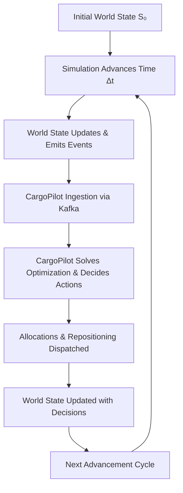
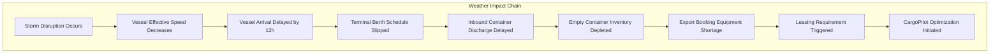
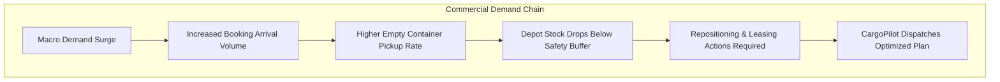
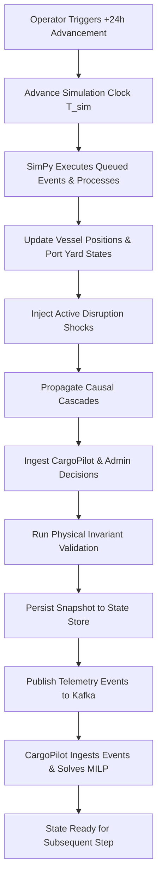

# CargoPilot Simulation Engine — Design Specification

> **Document:** Doc 1 — Simulation Engine Architecture & Behavioral Specification  
> **Version:** V1.0  
> **Status:** Approved Design Specification  
> **Companion Document:** [Doc 2 — Simulation Models & Mathematical Specification](file:///Users/adityasahrawat/dev/projects/cargoPilot/doc/CargoPilot%20Simulation%20Models%20&%20Mathematical%20Specification.md)  

---

## Table of Contents

1. [Objective & Design Goals](#1-objective--design-goals)
2. [Core Design Goals](#2-core-design-goals)
3. [Scope & Simulation Boundaries](#3-scope--simulation-boundaries)
4. [High-Level Architecture](#4-high-level-architecture)
5. [Component Responsibilities](#5-component-responsibilities)
6. [Simulation Time Model](#6-simulation-time-model)
7. [Simulation World Entities](#7-simulation-world-entities)
8. [Entity Lifecycle & State Machines](#8-entity-lifecycle--state-machines)
9. [Event Model](#9-event-model)
10. [Causal & Dependency Model](#10-causal--dependency-model)
11. [Booking, Allocation & 7-Day Lock](#11-booking-allocation--7-day-lock)
12. [Simulation ↔ CargoPilot Interaction](#12-simulation--cargopilot-interaction)
13. [State Storage, Persistence & Data Flow Architecture](#13-state-storage-persistence--data-flow-architecture)
14. [Kafka Event Backbone Architecture](#14-kafka-event-backbone-architecture)
15. [Simulation Execution Cycle](#15-simulation-execution-cycle)
16. [Validation & World Consistency](#16-validation--world-consistency)
17. [Scenario & Disruption System](#17-scenario--disruption-system)
18. [Reproducibility & Replay](#18-reproducibility--replay)
19. [Simulation UI & Operational Visibility](#19-simulation-ui--operational-visibility)
20. [V1 Design Principles](#20-v1-design-principles)
21. [Relationship to Doc 2](#21-relationship-to-doc-2)
22. [Definitive End-to-End System Architecture](#22-definitive-end-to-end-system-architecture)

---

## 1. Objective & Design Goals

### 1.1 Objective
The CargoPilot Simulation Engine provides a **time-aware, continuously evolving synthetic logistics world** used to test CargoPilot's decision-making, planning, and mathematical optimization workflows under realistic operational conditions.

The existing test environments in CargoPilot rely largely on static snapshots of vessels, ports, containers, bookings, demand, and inventory. Static datasets cannot validate how CargoPilot reacts when operational realities shift dynamically over time.

The Simulation Engine addresses this gap by continuously evolving the simulated world according to:
- Operational shipping rules and maritime physics
- Scheduled and stochastic events (arrivals, departures, loading, gate moves)
- External disruptions (storms, terminal congestion, equipment failures)
- Human administrator overrides
- CargoPilot optimization plans and equipment allocations

### 1.2 Core Closed-Loop Workflow
The simulator operates in a closed continuous feedback loop with CargoPilot:



#### Operational Example Over a 3-Day Progression:

- **Day 1:**
  - New export bookings submitted
  - Vessels depart loading ports on schedule
  - CargoPilot creates baseline allocation & repositioning plan
- **Day 2:**
  - En-route vessel encounters a storm disruption and is delayed by 12 hours
  - Port berth queue increases; discharge operations delayed
  - Regional empty equipment becomes tight
  - CargoPilot replans: triggers spot leasing and updates voyage allocations
- **Day 3:**
  - Delayed vessel berths and begins discharge
  - Equipment availability recovers at destination port
  - CargoPilot updates rolling-horizon plan

---

## 2. Core Design Goals

### 2.1 Time Awareness
The simulation maintains an independent, authoritative virtual simulation clock $T_{\text{sim}}$. Virtual time is completely decoupled from real-world wall clock execution time:

```text
Real Wall Clock Time:
   0.0 sec ─────────────── 1.5 sec ─────────────── 3.0 sec
      │                       │                       │
      ▼                       ▼                       ▼
Simulation Virtual Clock:
    Day 1                   Day 2                   Day 3
(2026-09-05)            (2026-09-06)            (2026-09-07)
```

### 2.2 Fast Simulation Execution
The engine executes discrete simulation steps orders of magnitude faster than real time. Advancing a simulated 24-hour day across fleets, ports, and thousands of containers takes seconds.

### 2.3 Controlled Step Advancement
In V1, manual simulation advancements are constrained to a maximum of one simulated day per step:

$$\Delta t \le 24\text{ hours per step}$$

Supported discrete UI step controls:
- `+1 Hour`
- `+6 Hours`
- `+12 Hours`
- `NEXT DAY (+24 Hours)`

Longer multi-week trajectories are realized through sequential step executions. This guarantees that operators can inspect, audit, and evaluate CargoPilot's state after every discrete operational interval.

### 2.4 Operational Realism
The simulator models realistic operational logistics behavior. Mutations are driven by physical causes rather than arbitrary uncoordinated randomness:

```text
Vessel Arrivals Cluster
         ↓
Berth Utilization Increases
         ↓
Waiting Queue Accumulates
         ↓
Port Congestion Index Climbs
         ↓
Crane Handling Takes Longer
         ↓
Vessel Departure Delayed
         ↓
Downstream Empty Container Discharge Delayed
```

### 2.5 Causal Behavior & Cascading
A perturbation in one operational dimension naturally cascades to downstream entities:

```text
Meteorological Storm
         ↓
Vessel Slow Steaming & Transit Delay
         ↓
Late Port Arrival
         ↓
Berth Rescheduling
         ↓
Container Discharge Delayed
         ↓
Depot Empty Inventory Unavailable
         ↓
Equipment Shortage for Outbound Bookings
         ↓
CargoPilot Optimization Triggered
```

### 2.6 Deterministic Reproducibility
Every simulation scenario run must be fully reproducible. Given:

$$\text{Initial World State} + \text{Scenario} + \text{Configuration} + \text{Random Seed} \implies \text{Identical Trajectory}$$

This guarantees rigorous, fair benchmarking between competing optimization algorithms and dispatch policies.

---

## 3. Scope & Simulation Boundaries

### 3.1 Entities Simulated in V1
```text
Simulation World
├── Ports & Terminals (Berths, cranes, yards, queues)
├── Vessels (Container ships, capacities, speeds, loads)
├── Voyages & Rotations (Legs, published schedules, active ETAs)
├── Containers & Equipment (20DC, 40DC, 40HC, conditions, statuses)
├── Bookings & Cargo Orders (Commercial customer demand)
├── Demand Forecasts (Macro trade flows and probabilistic volumes)
├── Equipment Supply & Leasing (Master and spot leasing agreements)
└── Disruptions (Weather, congestion, strikes, mechanical casualties)
```

### 3.2 Operational Processes in Scope (V1)
- Vessel transit, navigation progress, and leg traversal
- Port arrival, anchorage queueing, berthing, and departure
- Gantry crane loading, discharging, and container yard storage
- Customer booking submission, confirmation, modification, and cancellation
- Container equipment allocation and 7-day freeze enforcement
- Empty equipment repositioning execution across vessel legs
- External spot and term container leasing
- Operational disruptions, delay propagation, and recovery
- User / administrator overrides and manual reallocations

### 3.3 Explicitly Out of Scope for V1
The simulation engine targets **operational logistics realism**, not low-level physical micro-simulation:
- ❌ Detailed ship hydrodynamics, wave drag, and hull resistance
- ❌ Main engine thermodynamics, fuel combustion, and propeller cavitation
- ❌ Detailed oceanographic current and wave physics
- ❌ Exact micro-weather modeling
- ❌ Crane spreader kinematics, hoist motor physics, and rope dynamics
- ❌ Individual terminal worker behavioral psychology and shift breaks
- ❌ Full terminal 3D digital-twin physics

---

## 4. High-Level Architecture

The simulator connects to CargoPilot via an asynchronous, decoupled event-driven architecture:

```text
┌─────────────────────────────────────────────────────────┐
│                       USER / ADMIN                      │
└────────────────────────────┬────────────────────────────┘
                             │
                             ▼
┌─────────────────────────────────────────────────────────┐
│                   SIMULATION CONTROL                    │
│         [ +1h ]  [ +6h ]  [ +12h ]  [ NEXT DAY ]         │
│                   [ Pause ]  [ Reset ]                  │
└────────────────────────────┬────────────────────────────┘
                             │
                             ▼
┌─────────────────────────────────────────────────────────┐
│                    SIMULATION CLOCK                     │
└────────────────────────────┬────────────────────────────┘
                             │
                             ▼
┌─────────────────────────────────────────────────────────┐
│             SimPy SIMULATION KERNEL ENGINE              │
└────────────────────────────┬────────────────────────────┘
                             │
        ┌────────────────────┼────────────────────┐
        ▼                    ▼                    ▼
  ┌───────────┐        ┌───────────┐        ┌───────────┐
  │   Vessel  │        │    Port   │        │   Demand  │
  │   Model   │        │   Model   │        │   Model   │
  └─────┬─────┘        └─────┬─────┘        └─────┬─────┘
        │                    │                    │
        ▼                    ▼                    ▼
  ┌───────────┐        ┌───────────┐        ┌───────────┐
  │   Voyage  │        │ Container │        │  Booking  │
  │   Model   │        │   Model   │        │   Model   │
  └─────┬─────┘        └─────┬─────┘        └─────┬─────┘
        └────────────────────┼────────────────────┘
                             │
                             ▼
┌─────────────────────────────────────────────────────────┐
│                    DISRUPTION ENGINE                    │
└────────────────────────────┬────────────────────────────┘
                             │
                             ▼
┌─────────────────────────────────────────────────────────┐
│                       WORLD STATE                       │
│            (Current Simulated Operational Truth)        │
└────────────────────────────┬────────────────────────────┘
                             │
                             ▼
┌─────────────────────────────────────────────────────────┐
│                KAFKA EVENT TRANSPORT LAYER              │
└────────────────────────────┬────────────────────────────┘
                             │
                             ▼
┌─────────────────────────────────────────────────────────┐
│                   CARGOPILOT INGESTION                  │
│             [ Normalize ]  [ Validate ]  [ Apply ]      │
└────────────────────────────┬────────────────────────────┘
                             │
                             ▼
┌─────────────────────────────────────────────────────────┐
│              CARGOPILOT STATE / DATABASE                │
└────────────────────────────┬────────────────────────────┘
                             │
                             ▼
┌─────────────────────────────────────────────────────────┐
│                   CARGOPILOT OPTIMIZER                  │
└────────────────────────────┬────────────────────────────┘
                             │
                             ▼ Decisions
┌─────────────────────────────────────────────────────────┐
│                  ALLOCATION & PLAN OUTPUT               │
└────────────────────────────┬────────────────────────────┘
                             │
                             ▼
┌─────────────────────────────────────────────────────────┐
│                       WORLD STATE                       │
└─────────────────────────────────────────────────────────┘
```

---

## 5. Component Responsibilities

### 5.1 Simulation Controller
The operator interface and orchestration coordinator:
- Starts, pauses, resumes, and resets simulation runs
- Enforces single advancement step limits ($\Delta t \le 24\text{ hours}$)
- Displays real-time simulation clock and elapsed simulated time
- Triggers and manages experimental scenarios and disruption injections

### 5.2 Simulation Clock
The authoritative temporal baseline for the simulated world:
- Tracks discrete timestamps (e.g., `2026-09-05 00:00` $\rightarrow$ `2026-09-06 00:00`)
- Strictly decoupled from the operating system's system clock

### 5.3 SimPy Execution Kernel
- **SimPy Role:** Manages virtual discrete event scheduling, timeout priorities, cooperative coroutines, and simulated resource queues (*"When should it happen?"*).
- **Domain Models Role:** Implements maritime logistics rules, capacity limits, and container state transitions (*"What should happen?"*).

```text
Domain Model: "Vessel requires 72 simulated hours to transit leg."
      ↓
SimPy Kernel: "Schedule vessel arrival event at (T_current + 72h)."
```

### 5.4 Simulation Domain Models
Specialized models responsible for maritime and equipment dynamics:
- **Vessel Model:** Speed, position, load, and mechanical status
- **Voyage Model:** Port rotations, schedules, and ETA calculation
- **Port Model:** Berths, cranes, yard capacity, queues, and congestion
- **Container Model:** Individual asset status, type, location, and condition
- **Booking Model:** Commercial order generation and customer lifecycles
- **Demand Model:** Regional cargo flow generation and seasonality
- **Equipment & Leasing Model:** Pool balances and lease activation
- **Disruption Model:** Weather, strikes, congestion, and failure shocks

### 5.5 World State
Represents the **authoritative ground truth** of the simulated world at instant $t$. Every simulation step starts from the latest valid state and advances forward continuously.

### 5.6 Kafka Event Transport Layer
The asynchronous message bus between the simulator and CargoPilot:
- Streams lifecycle telemetry (`VESSEL_ARRIVED`, `BOOKING_CREATED`, `CONTAINER_DAMAGED`, `PORT_CONGESTION_CHANGED`)
- Streams optimization decisions (`ALLOCATION_CHANGED`, `REPOSITIONING_DISPATCHED`)
- **Note:** Kafka transports changes; it does not store the authoritative world state.

### 5.7 CargoPilot Platform
The decision support system under evaluation:
- Consumes events from Kafka and reconstructs operational state
- Runs mathematical optimization solvers (MILP)
- Generates container allocation plans, repositioning moves, and lease orders
- Enforces commercial business rules (e.g., 7-day pre-departure allocation freeze)

### 5.8 Admin / Human Operator
Human-in-the-loop overrides executed via CargoPilot APIs:
- Manually reallocates specific containers to bookings
- Reassignment events publish back to Kafka and update the simulation world for future steps

---

## 6. Simulation Time Model

Virtual simulation time advances discretely independently of wall clock execution time:

```text
Real Wall Clock Time:
  10.0 seconds
       │
       ▼
Simulated Horizon:
Day 1 (00:00) ──► Day 2 (00:00)
```

$$\Delta t \le 24\text{ hours per manual advancement}$$

Advancing 30 simulation days involves 30 sequential 24-hour advancement iterations.

---

## 7. Simulation World Entities

### 7.1 Port
```text
Port
├── Berths (Dedicated vessel berths, draft limitations)
├── Cranes (Ship-to-shore gantry cranes, moves/hour throughput)
├── Yard (CY storage capacity in TEU, stacking areas)
├── Vessel Queue (Anchorage queue for awaiting berths)
├── Container Inventory (Full import, full export, empty stock by type)
├── Handling Capacity (Gross operational terminal moves per hour)
└── Congestion State (Dynamic utilization index)
```

### 7.2 Vessel
```text
Vessel
├── Current Location (Port UN/LOCODE or maritime coordinates)
├── Current Voyage (Active voyage identifier)
├── Destination (Target discharge port)
├── Status (PLANNED | AT_PORT | LOADING | IN_TRANSIT | DISCHARGING)
├── Position (Nautical mile progression along route)
├── ETA (Estimated date and time of arrival)
├── Schedule Variance (Cumulative deviation in hours)
├── Capacity (Max container capacity in TEU)
└── Current Load (Active onboard TEU count)
```

### 7.3 Voyage
```text
Voyage
├── Vessel (Assigned vessel ID)
├── Origin & Destination (Leg boundary ports)
├── Scheduled Departure & Arrival (Published pro-forma schedule)
├── Actual Departure & Estimated Arrival (Realized operational tracking)
└── Status (SCHEDULED | ACTIVE | COMPLETED | CANCELLED)
```

### 7.4 Container
```text
Container
├── Equipment Type (20DC | 40DC | 40HC)
├── Current Location (Port CY | Depot | Shipper Premises | Vessel ID)
├── Status (EMPTY | ALLOCATED | LOADED | IN_TRANSIT | AVAILABLE)
├── Condition (GOOD | DAMAGED | MAINTENANCE | UNAVAILABLE)
├── Booking (Assigned commercial booking ID)
└── Ownership (OWNED | LONG_TERM_LEASE | SPOT_LEASE)
```

### 7.5 Booking
```text
Booking
├── Origin & Destination (Port of loading / Port of discharge)
├── Cargo (Commodity type and weight)
├── Equipment Requirement (Quantity and equipment type)
├── Departure (Target vessel voyage leg)
├── Status (SUBMITTED | CONFIRMED | ALLOCATED | CANCELLED | FULFILLED)
└── Lock Status (UNLOCKED | LOCKED)
```

### 7.6 Demand
Stochastic and trend-driven commercial cargo requirements driving future booking generation.

### 7.7 Equipment & Leasing
Aggregated port inventory balances, regional shortage calculations, and commercial leasing contract states.

### 7.8 Disruptions
External operational shocks (storms, strikes, mechanical casualties, yard saturation) altering baseline parameters.

---

## 8. Entity Lifecycle & State Machines

### 8.1 Vessel Lifecycle
```text
[PLANNED] ──► [AT_PORT] ──► [LOADING] ──► [DEPARTED] ──► [IN_TRANSIT]
                                                               │
[AT_PORT] ◄── [DISCHARGING] ◄── [BERTHED] ◄── [ARRIVED] ◄──────┘
```

### 8.2 Container Lifecycle
```text
[EMPTY_AVAILABLE] ──► [ALLOCATED] ──► [GATE_OUT / PICKUP] ──► [STUFFING]
                                                                  │
[AVAILABLE] ◄── [DISCHARGE] ◄── [IN_TRANSIT] ◄── [LOADED] ◄───────┘
```

### 8.3 Booking Lifecycle
```text
[SUBMITTED] ──► [CONFIRMED] ──► [ALLOCATED] ──► [LOCKED (at Cutoff)] ──► [COMPLETED]
```

---

## 9. Event Model

The simulation engine communicates state transitions through structured, immutable JSON event payloads:

```json
{
  "event_id": "evt-c7f8a92b-4e12-4d3b-9a2c",
  "event_type": "VESSEL_ARRIVED",
  "entity_type": "VESSEL",
  "entity_id": "V001",
  "timestamp": "2026-09-06T08:00:00Z",
  "source": "simulation-engine",
  "payload": {
    "port_unlocode": "SGSIN",
    "voyage_id": "VOY-2026-09-A",
    "schedule_variance_hours": 3.5,
    "onboard_teu": 4250
  }
}
```

Every event encapsulates:
- Unique event identifier (`event_id`)
- Event classification (`event_type`)
- Target entity reference (`entity_type`, `entity_id`)
- Authoritative simulation timestamp (`timestamp`)
- Emitting subsystem (`source`)
- Contextual domain payload (`payload`)

---

## 10. Causal & Dependency Model

The engine strictly prioritizes **causal propagation** over uncorrelated random changes:





---

## 11. Booking, Allocation & 7-Day Lock

### 11.1 Booking Creation & Allocation Pipeline
```text
Simulation Engine
       │
       │ BOOKING_CREATED
       ▼
     Kafka
       │
       ▼
   CargoPilot
       │
       ▼
Allocation Optimization
       │
       ▼
World State Updated
```

### 11.2 Seven-Day Freeze & Cutoff Window
For any booking with scheduled vessel departure $T_{\text{departure}}$:

$$T_{\text{cutoff}} = T_{\text{departure}} - 7\text{ days}$$

```text
Booking Scheduled Departure (Day D₀)
       │
<──────┴───────── 7-Day Planning & Reallocation Window ─────────>
       │
       ├── D-14 to D-7: Allocation dynamic and modifiable by CargoPilot
       │
[7-Day Cutoff Window: D-7]
       │
       └── D-7 to D₀: ALLOCATION LOCKED
           ├── Normal CargoPilot re-optimization prohibited
           └── Physical equipment committed to operational execution
```

Once locked:

$$\text{Allocation}_{t+1} = \text{Allocation}_t$$

Only authorized emergency administrator overrides can alter an allocation inside the 7-day freeze boundary.

---

## 12. Simulation ↔ CargoPilot Interaction

The relationship between the simulation engine and CargoPilot is bidirectional:

### 12.1 Simulation $\rightarrow$ CargoPilot (Ground Truth Telemetry)
The simulator generates:
- New customer booking submissions
- Vessel departures, transit tracking, and arrival slips
- Port congestion changes and berth statuses
- Container gate moves, damages, and availability changes
- Disruption shocks (weather, equipment breakdowns)

### 12.2 CargoPilot $\rightarrow$ Simulation (Tactical Operational Decisions)
CargoPilot executes optimization solvers and dispatches:
- Physical container-to-booking allocations
- Empty equipment repositioning voyage leg assignments
- Off-hire / on-hire container leasing orders

### 12.3 Admin Override Flow
```text
Admin User
   │
   ▼
CargoPilot API
   │
   ▼
Validation & Business Rules
   │
   ▼
CargoPilot Database
   │
   ▼
ALLOCATION_CHANGED Event
   │
   ▼
Kafka
   │
   ▼
Simulation Engine (Observes update and enforces in next step)
```

---

## 13. State Storage, Persistence & Data Flow Architecture

### 13.1 Overview
The Simulation Engine and CargoPilot communicate asynchronously via events, while persistent operational state is stored in databases.

```text
┌────────────────────────────────────────┐
│           SIMULATION ENGINE            │
│   [SimPy]   [Models]   [Sim State]     │
└───────────────────┬────────────────────┘
                    │ 1. Generate Telemetry Event
                    ▼
┌────────────────────────────────────────┐
│         KAFKA EVENT BACKBONE           │
└───────────────────┬────────────────────┘
                    │ 2. Consume Event
                    ▼
┌────────────────────────────────────────┐
│          CARGOPILOT INGESTION          │
│   [Normalize]  [Validate]  [Apply]     │
└───────────────────┬────────────────────┘
                    │ 3. Persist State
                    ▼
┌────────────────────────────────────────┐
│             CARGOPILOT DB              │
│ (Ports, Vessels, Containers, Bookings) │
└───────────────────┬────────────────────┘
                    │ 4. Read Current State
                    ▼
┌────────────────────────────────────────┐
│          CARGOPILOT OPTIMIZER          │
│     (MILP Solver & Decision Engine)    │
└───────────────────┬────────────────────┘
                    │ 5. Decision & Plan Output
                    ▼
┌────────────────────────────────────────┐
│             CARGOPILOT DB              │
└───────────────────┬────────────────────┘
                    │ 6. Emit Decision Event
                    ▼
┌────────────────────────────────────────┐
│         KAFKA EVENT BACKBONE           │
└───────────────────┬────────────────────┘
                    │ 7. Consume Decision Event
                    ▼
┌────────────────────────────────────────┐
│           SIMULATION ENGINE            │
│    (Applies decision to next step)     │
└────────────────────────────────────────┘
```

### 13.2 Partitioning: What is Stored Where?

#### 1. Simulation Engine Runtime State
Maintained internally by the simulation kernel to preserve execution continuity:
- `simulation_time`: Authoritative virtual time $T_{\text{sim}}$
- Active SimPy coroutine processes and timeouts
- Future event queue (scheduled chronologically)
- Random generator state and active scenario overrides

#### 2. CargoPilot Operational Database
Persistent relational storage representing current enterprise facts:
- **Ports & Locations:** UN/LOCODEs, coordinates, berth and yard capacities
- **Vessels & Fleet:** Physical vessels, deadweight, TEU capacities
- **Voyages & Schedules:** Legs, departure/arrival tracking, port rotations
- **Containers:** Inventory tracking, equipment types, locations, conditions
- **Bookings & Allocations:** Cargo orders, assigned container IDs, lock statuses
- **Optimization History:** Generated plans, approved recommendations, solver KPIs

#### 3. Kafka Message Backbone
Transports operational deltas and event streams; **does not** act as the primary state database:
- `booking.created` / `booking.cancelled`
- `vessel.arrived` / `vessel.delayed` / `vessel.departed`
- `container.available` / `container.damaged` / `container.gate_out`
- `allocation.created` / `allocation.changed`

### 13.3 End-to-End Workflow: Booking Creation Example
1. **Simulation Day 1:** The simulator's demand model generates `Booking B001` (Shanghai $\rightarrow$ Chennai, Departure Day 8, 10 containers).
2. **Event Emission:** Simulator emits `BOOKING_CREATED` to Kafka.
3. **CargoPilot Ingestion:** Ingestion consumer validates the event and writes `B001` to CargoPilot DB (`Status = CONFIRMED`, `Allocation = NULL`).
4. **Optimization:** CargoPilot optimizer evaluates network stock and assigns containers `C101` through `C110` to `B001`.
5. **Persistence:** The allocation is committed to CargoPilot DB.

### 13.4 Admin Modification Workflow
1. An administrator reassigns `B001` from `C101` to `C205` via the Admin Workbench.
2. CargoPilot API validates that `B001` departure is $>7\text{ days}$ away (`Allocation State = MODIFIABLE`).
3. CargoPilot DB updates and emits `ALLOCATION_CHANGED` to Kafka.
4. The Simulation Engine consumes the event and updates its internal world state.

### 13.5 Next-Day Advancement Loop
1. Operator clicks **[NEXT DAY]** advancing $T_{\text{sim}}$ from `Day 1 00:00` to `Day 2 00:00` ($+24\text{h}$).
2. SimPy processes all events and timeouts scheduled between Day 1 and Day 2.
3. The simulator applies the updated allocation (`B001` $\rightarrow$ `C205`).
4. Resulting events stream to Kafka $\rightarrow$ CargoPilot ingests and replans.

### 13.6 Core Architectural Invariant: Kafka vs. Database

```text
                  KAFKA
             "What changed?"
              (Event Stream)
                    │
                    ▼
             ┌───────────────┐
             │   Database    │
             │ "What is now  │
             │   current?"   │
             └───────────────┘
```

- **Kafka:** Event streaming, temporal ordering, replay auditability, decoupled integration.
- **Database:** Authoritative queryable state and operational snapshots.
- **SimPy:** Virtual time advancement and discrete process execution.
- **Simulation Engine:** Creates, evolves, and enforces synthetic logistics reality.
- **CargoPilot:** Decides optimal operational allocations and repositioning moves.

---

## 14. Kafka Event Backbone Architecture

### 14.1 Topic Partitioning Scheme

| Topic Name | Producer | Consumer | Key Events |
| :--- | :--- | :--- | :--- |
| `simulation.vessel-events` | Simulation Engine | CargoPilot | `VESSEL_DEPARTED`, `VESSEL_ARRIVED`, `VESSEL_DELAYED` |
| `simulation.port-events` | Simulation Engine | CargoPilot | `PORT_CONGESTION_CHANGED`, `BERTH_OCCUPIED` |
| `simulation.container-events`| Simulation Engine | CargoPilot | `CONTAINER_GATE_IN`, `CONTAINER_GATE_OUT`, `CONTAINER_DAMAGED` |
| `simulation.booking-events` | Simulation Engine | CargoPilot | `BOOKING_CREATED`, `BOOKING_CANCELLED`, `BOOKING_MODIFIED` |
| `simulation.disruption-events`| Simulation Engine | CargoPilot | `STORM_STARTED`, `STORM_ENDED`, `TERMINAL_STRIKE` |
| `cargopilot.allocation-events`| CargoPilot | Simulation Engine | `ALLOCATION_COMMITTED`, `ALLOCATION_LOCKED` |
| `cargopilot.decision-events` | CargoPilot | Simulation Engine | `REPOSITIONING_DISPATCHED`, `LEASE_ORDERED` |

---

## 15. Simulation Execution Cycle



---

## 16. Validation & World Consistency

The engine validates physical and operational invariants at every time step:

### 16.1 Entity Spatial Uniqueness
A single container or vessel cannot exist simultaneously in two different physical locations:

$$\text{Location}(c, t) = l_1 \land \text{Location}(c, t) = l_2 \implies l_1 = l_2$$

### 16.2 Physical Capacity Limits
Port terminal yards and vessel slots can never be overfilled:

$$\text{YardOccupancy}(l, t) \le \text{YardCapacity}(l) \quad \forall l$$

$$\text{CurrentLoad}(v, t) \le \text{VesselCapacity}(v) \quad \forall v$$

### 16.3 Allocation Consistency
Container allocations must link to valid, active bookings and compatible equipment specifications. Once inside the 7-day cutoff window, allocations cannot be altered by normal planning processes.

---

## 17. Scenario & Disruption System

### 17.1 Predefined Scenario Catalog
- `NORMAL_OPERATIONS`: Baseline seasonal demand without abnormal shocks
- `PORT_CONGESTION`: Hub terminal bottlenecks (e.g., Singapore)
- `VESSEL_DELAY`: Transpacific / Asia-Europe fleet schedule slippage
- `TYPHOON_STORM`: Multi-day maritime route weather disruptions
- `EQUIPMENT_DEFICIT`: Acute empty container deficit at key Asian export ports
- `DEMAND_SPIKE`: Holiday volume surge (+35%)
- `COMPOUND_DISRUPTION`: Simultaneous weather, congestion, and equipment shortage

### 17.2 Scenario Definition Schema
```text
Scenario
├── scenario_id: Unique identifier
├── start_time: Execution start simulation time
├── duration_days: Active duration in simulated days
├── affected_entities: Target ports, vessels, and route legs
├── severity: Numeric scalar [0.0 - 1.0]
├── behavior: Parameter override definitions
└── random_seed: Seed governing stochastic draws
```

---

## 18. Reproducibility & Replay

Each simulation run is deterministically identified by:
- `simulation_id`: Unique run GUID
- `scenario_id`: Evaluated scenario code
- `random_seed`: Master PRNG seed
- `initial_world_state_id`: Starting database baseline
- `simulation_start_time`: Initial virtual clock baseline
- `configuration_hash`: Hash of all model parameters
- `event_history`: Chronological audit log of all executed events

This guarantees that two competing optimization algorithms can be tested against the exact same operational conditions.

---

## 19. Simulation UI & Operational Visibility

The simulator exposes real-time state to the operator:

```text
┌─────────────────────────────────────────────────────────────────────────┐
│                          CARGOPILOT SIMULATOR                           │
│                                                                         │
│ Simulation Time: 2026-09-05 00:00 (Day 1)                               │
│                                                                         │
│ [ +1 HOUR ]  [ +6 HOURS ]  [ +12 HOURS ]  [ NEXT DAY (+24h) ]           │
│ [ PAUSE ]    [ RESET ]     [ INJECT DISRUPTION ]                        │
│                                                                         │
├─────────────────────────────────────────────────────────────────────────┤
│ WORLD SUMMARY                                                           │
│                                                                         │
│ Active Vessels:       48        Active Voyages:      32                 │
│ Total Containers:  2,340        Port Locations:      14                 │
│ Confirmed Bookings:  427        Equipment Shortage:   0 TEU             │
│                                                                         │
├─────────────────────────────────────────────────────────────────────────┤
│ OPERATIONAL TELEMETRY LOG                                               │
│                                                                         │
│ [04:30] ✓ Vessel V001 berthed at Singapore (SGSIN)                      │
│ [08:15] ⚠ Vessel V014 delayed by 8h due to adverse weather              │
│ [11:00] + Booking B829 created (Shanghai → Chennai, 20x 40HC)           │
│ [14:45] ⚠ Container MSCU729104 damaged during terminal handling        │
│                                                                         │
├─────────────────────────────────────────────────────────────────────────┤
│ CARGOPILOT STATUS                                                       │
│                                                                         │
│ Ingestion State: Synchronized ✓                                         │
│ Optimization Solver: Solved (0.84s) ✓                                   │
│ Recommendations: 4 Repositioning Legs, 1 Leased Block                   │
└─────────────────────────────────────────────────────────────────────────┘
```

---

## 20. V1 Design Principles

1. **Decoupled Time:** Simulation time is strictly independent of wall clock time.
2. **SimPy Role:** SimPy manages virtual discrete event scheduling, not shipping business logic.
3. **World Authority:** The simulator owns simulated-world behavior; CargoPilot owns optimization and planning.
4. **Event Backbone:** Kafka transports events; it is not the primary database of truth.
5. **State Continuity:** Authoritative state survives across simulation advancement steps.
6. **Bidirectional Awareness:** The simulator observes CargoPilot and admin allocation decisions.
7. **Controlled Stepping:** Single manual advancements cannot exceed 24 simulated hours.
8. **Causal Fidelity:** Entity updates follow physical logistics causality.
9. **Physical Consistency:** The simulator enforces spatial uniqueness and capacity constraints.
10. **Reproducibility:** Experiments are deterministic given the same seed and scenario.
11. **Mathematical Separation:** Detailed equations are specified in Doc 2.

---

## 21. Relationship to Doc 2

- **Doc 1 defines:** What exists, how the system is structured, what happens, when it happens, and how components interact.
- **Doc 2 defines:** How the individual behaviors, probabilities, and economic costs are calculated mathematically.

```text
DOC 1: Vessel can be delayed by weather
   ↓
DOC 2: Weather severity → speed reduction factor / delay probability

DOC 1: Port congestion impacts vessel handling
   ↓
DOC 2: Resource utilization ratio → non-linear congestion penalty function

DOC 1: Demand creates bookings
   ↓
DOC 2: Stochastic arrival process → discrete booking creation probability
```

---

## 22. Definitive End-to-End System Architecture

```text
╔═════════════════════════════════════════════════════════════════════╗
║                       USER / ADMIN INTERFACE                        ║
╚══════════════════════════════┬══════════════════════════════════════╝
                               │
                               ▼
┌─────────────────────────────────────────────────────────────────────┐
│                        SIMULATION CONTROLLER                        │
│             Controls: +1h, +6h, +12h, NEXT DAY (+24h max)           │
└──────────────────────────────┬──────────────────────────────────────┘
                               │
                               ▼
┌─────────────────────────────────────────────────────────────────────┐
│                          SIMULATION CLOCK                           │
└──────────────────────────────┬──────────────────────────────────────┘
                               │
                               ▼
┌─────────────────────────────────────────────────────────────────────┐
│                      SimPy SIMULATION KERNEL                        │
└──────────────────────────────┬──────────────────────────────────────┘
                               │
          ┌────────────────────┼────────────────────┐
          ▼                    ▼                    ▼
    ┌───────────┐        ┌───────────┐        ┌───────────┐
    │  Vessels  │        │   Ports   │        │   Demand  │
    └─────┬─────┘        └─────┬─────┘        └─────┬─────┘
          │                    │                    │
          ▼                    ▼                    ▼
    ┌───────────┐        ┌───────────┐        ┌───────────┐
    │  Voyages  │        │Containers │        │  Bookings │
    └─────┬─────┘        └─────┬─────┘        └─────┬─────┘
          └────────────────────┼────────────────────┘
                               │
                               ▼
┌─────────────────────────────────────────────────────────────────────┐
│                          DISRUPTION LOGIC                           │
└──────────────────────────────┬──────────────────────────────────────┘
                               │
                               ▼
┌─────────────────────────────────────────────────────────────────────┐
│                          SIMULATION STATE                           │
└──────────────────────────────┬──────────────────────────────────────┘
                               │
                               ▼
┌─────────────────────────────────────────────────────────────────────┐
│                        KAFKA EVENT BACKBONE                         │
└──────────────────────────────┬──────────────────────────────────────┘
                               │
                               ▼
┌─────────────────────────────────────────────────────────────────────┐
│                       CARGOPILOT INGESTION                          │
└──────────────────────────────┬──────────────────────────────────────┘
                               │
                               ▼
┌─────────────────────────────────────────────────────────────────────┐
│                       CARGOPILOT DATABASE                           │
└──────────────────────────────┬──────────────────────────────────────┘
                               │
                               ▼
┌─────────────────────────────────────────────────────────────────────┐
│                        OPTIMIZATION ENGINE                          │
└──────────────────────────────┬──────────────────────────────────────┘
                               │
                               ▼
┌─────────────────────────────────────────────────────────────────────┐
│                      ALLOCATION / PLAN OUTPUT                       │
└──────────────────────────────┬──────────────────────────────────────┘
                               │
                               ▼
┌─────────────────────────────────────────────────────────────────────┐
│                       CARGOPILOT DATABASE                           │
└──────────────────────────────┬──────────────────────────────────────┘
                               │
                               ▼
┌─────────────────────────────────────────────────────────────────────┐
│                        KAFKA EVENT BACKBONE                         │
└──────────────────────────────┬──────────────────────────────────────┘
                               │
                               ▼
┌─────────────────────────────────────────────────────────────────────┐
│                          SIMULATION ENGINE                          │
└──────────────────────────────┬──────────────────────────────────────┘
                               │
                               ▼ [ NEXT +24 HOURS REPEAT LOOP ]
```

> [!TIP]
> **Implementation Note for Service Architecture:**  
> The Simulation Engine runs as an isolated microservice (`services/simulation`) maintaining its internal SimPy execution graph and publishing telemetry to Kafka. CargoPilot (`services/api`) consumes these events, updates its operational tables (`cargo_pilot.db`), solves MILP optimization routines, and publishes allocation commands back to Kafka, ensuring a clean decoupled boundary.
