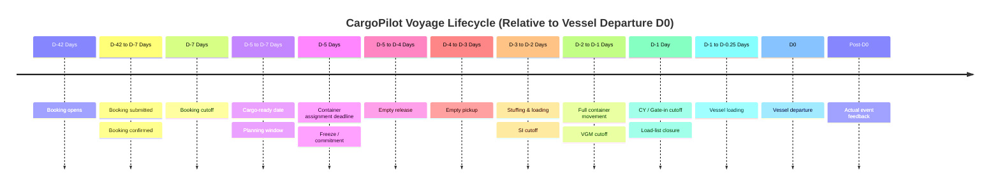

# CargoPilot Operational Timeline

## Purpose

This document defines the end-to-end operational timeline for ocean freight container operations within CargoPilot. It maps key milestones from initial booking opening through vessel departure and post-event feedback, establishing timing baselines relative to vessel departure ($D_0$) and specifying the operational questions and data points captured at each stage.

---

## Operational Milestones

| Step | Operational Milestone | Description |
| :---: | :--- | :--- |
| **1** | Booking opens | Booking window opens for shippers/customers on a scheduled voyage |
| **2** | Booking submitted | Shipper submits a booking request specifying equipment, cargo, and routing |
| **3** | Booking confirmed | Carrier accepts/confirms the booking request |
| **4** | Booking cutoff | Final deadline for shippers to submit or modify bookings |
| **5** | Cargo-ready date | Date/time cargo is ready for container stuffing and transport |
| **6** | CargoPilot planning window | Continuous optimization and equipment allocation window |
| **7** | Container assignment deadline | Deadline to assign specific physical containers or allocations |
| **8** | Freeze / commitment | Operational plan is frozen; assignments committed to operational execution |
| **9** | Empty release | Authorization and instructions generated for empty container release at depot |
| **10** | Empty pickup | Shipper / trucker picks up empty container from depot |
| **11** | Stuffing / loading | Cargo is loaded into container at shipper facility or CFS |
| **12** | Full-container movement | Loaded container in transit from stuffing location to port container yard (CY) |
| **13** | CY / gate-in cutoff | Terminal gate-in deadline for loaded containers to be accepted for voyage |
| **14** | SI cutoff | Shipping Instructions (SI) submission cutoff deadline |
| **15** | VGM cutoff | Verified Gross Mass (VGM) submission cutoff deadline |
| **16** | Load-list closure | Final vessel stowage / load list finalized and closed |
| **17** | Vessel loading | Physical crane and stevedoring operations loading containers onto vessel |
| **18** | Vessel departure ($D_0$) | Vessel departs berth / port of loading (Baseline Day 0) |
| **19** | Actual event feedback | Real-time event telemetry fed back to CargoPilot for state reconstruction |

---

## Event Evaluation Framework

For every operational milestone and timeline event, CargoPilot identifies the following 8 core dimensions:

| # | Dimension / Question | Example: "Booking Opens" |
| :-: | :--- | :--- |
| **1** | **What is the event?** | Booking becomes available for submission |
| **2** | **Who / what triggers it?** | Carrier service schedule or commercial booking system |
| **3** | **What information exists at this point?** | Voyage, service loop, origin, destination, equipment demand estimate |
| **4** | **What information is still unknown?** | Final confirmed bookings, exact container IDs, actual pickup times |
| **5** | **What can CargoPilot do now?** | Register forecasted demand / consider in medium-range planning & positioning |
| **6** | **Can CargoPilot change anything?** | Planning recommendations only (e.g., repositioning empties), not physical booking rules |
| **7** | **What is the next critical deadline?** | Booking confirmation, booking cutoff, cargo-ready deadline |
| **8** | **What timestamp should DB store?** | `booking_open_at` |

---

## Timing Baseline (Relative to Vessel Departure)

> **Baseline Reference:** Vessel Departure = **Day 0 ($D_0$)**

| # | Milestone | Recommended Timing (Relative to $D_0$) | Operational Context & CargoPilot Relevance |
| :-: | :--- | :--- | :--- |
| **1** | Booking opens | **D-42 days** (~6 weeks) | Initial voyage demand window opens |
| **2** | Booking submitted | **D-42 to D-7 days** | Variable; anytime between booking open and booking cutoff |
| **3** | Booking confirmed | **Within hours / 1 business day** of submission | Confirmed booking enters CargoPilot boundary as hard demand |
| **4** | Booking cutoff | **D-7 days** (~1 week) | Carrier closes new booking acceptance |
| **5** | Cargo-ready date | **D-5 to D-7 days** | Cargo ready for stuffing; sets earliest empty pickup need |
| **6** | CargoPilot planning window | **Continuous** (Target: prior to **D-5 / D-7**) | Continuous optimization; critical decisions finalized before freeze |
| **7** | Container assignment deadline | **D-5 days** | Specific container IDs or depot releases must be finalized |
| **8** | Freeze / commitment | **D-5 days** | Allocation is locked; execution orders dispatched |
| **9** | Empty release | **D-5 to D-4 days** | Release orders sent to depot for customer pickup |
| **10** | Empty pickup | **D-4 to D-3 days** | Trucker retrieves empty container from depot |
| **11** | Stuffing / loading | **D-3 to D-2 days** | Shipper packs cargo into container |
| **12** | Full-container movement to port | **D-2 to D-1 days** | Drayed/transported to marine terminal |
| **13** | CY / gate-in cutoff | **D-1 day** (sometimes **D-2**) | Hard terminal deadline for gated-in containers |
| **14** | SI cutoff | **D-3 to D-2 days** | Shipping instructions submitted for manifest |
| **15** | VGM cutoff | **D-2 to D-1 days** | Weight certification submitted for stowage planning |
| **16** | Load-list closure | **D-1 day** (~hours before loading) | Final load list locked with terminal/stowage planner |
| **17** | Vessel loading | **D-1 to D-0.25 days** (6–24 hrs before departure) | Stevedores load containers to assigned vessel slots |
| **18** | Vessel departure | **D0** (Day 0) | Voyage commences; containers transition to in-transit status |
| **19** | Actual event feedback | **Immediate** / Real-time | Telemetry & gate events feed state reconstruction & iterative planning |

---

## Visual Timeline

### Timeline Overview



### Operational Milestone ASCII Diagram

```text
D-42                  D-7      D-5       D-4      D-3      D-2      D-1       D0
 │                      │         │         │        │        │        │         │
 │                      │         │         │        │        │        │         │
 ▼                      ▼         ▼         ▼        ▼        ▼        ▼         ▼
Booking                 Booking   Cargo     Empty    Empty    Stuff   Gate-in   Vessel
opens                   cutoff    ready     release  pickup   /move             departs
 │                                  │         │        │        │
 │                                  │         │        │        │
 └── bookings ──────────────────────┘         │        │        │
                                              │        │        │
                                      ┌───────┴────────┴────────┐
                                      │ CargoPilot commitment   │
                                      │ / assignment frozen     │
                                      └─────────────────────────┘
```
