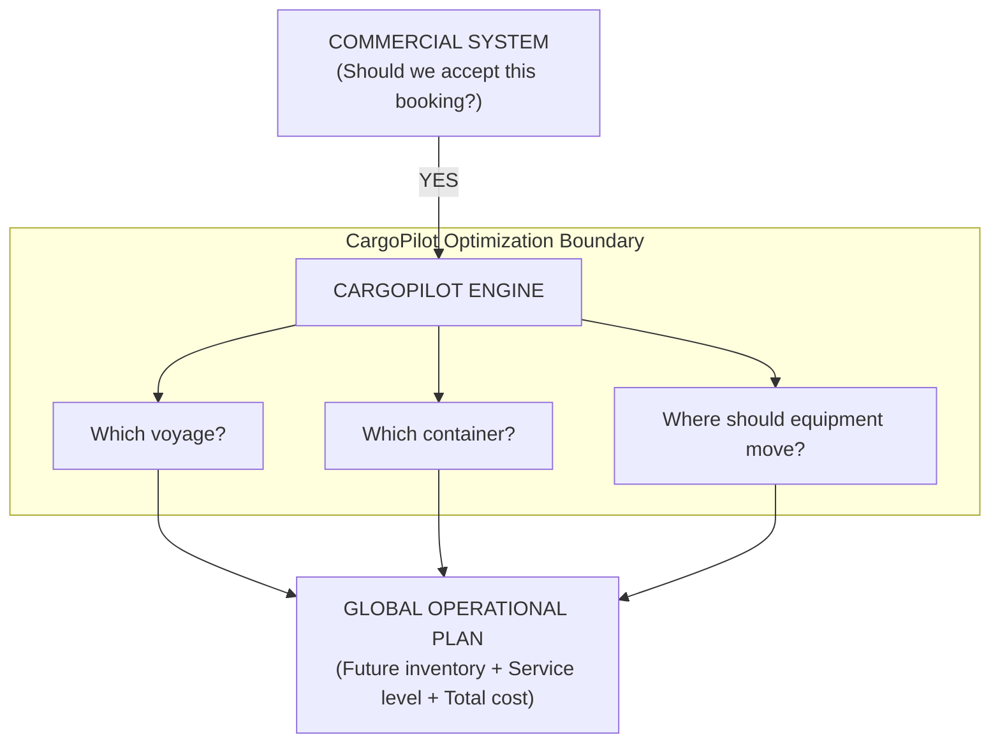
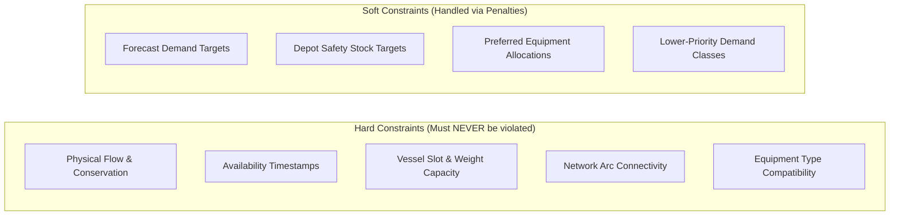
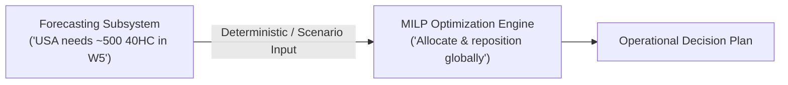
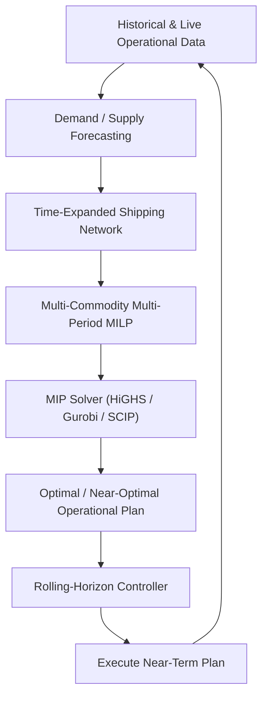

# CargoPilot Optimization Engine
## Phase 1 — Algorithm & Optimization Strategy Selection

- **Status:** Phase 1 — Closed
- **Purpose:** Select the optimization architecture, algorithms, mathematical foundation, and future extensions for CargoPilot V1.

---

## Phase 1 Scope & Boundary Definition

> **CargoPilot V1 Definition:**  
> Integrated booking fulfillment and container-positioning optimization, given commercially accepted bookings and a fixed vessel network.

### Scope Breakdown

| What CargoPilot V1 Optimizes | What CargoPilot V1 Does NOT Optimize |
| :--- | :--- |
| **Booking Fulfillment**<br>• Booking → voyage assignment<br>• Booking → container assignment | **Commercial Decisions**<br>• Booking acceptance / rejection |
| **Equipment Management**<br>• Container positioning<br>• Empty container repositioning | **Vessel Fleet Management**<br>• Vessel deployment<br>• Vessel scheduling<br>• Vessel routing |
| **Inventory & Supply**<br>• Future depot/port positioning<br>• Leasing and container acquisition | **Revenue Management**<br>• Customer pricing<br>• Yield / revenue optimization |
| **Network Utilization**<br>• Use of available voyage capacity<br>• Multi-leg repositioning<br>• Future equipment availability | |

### Product Boundary



```text
COMMERCIAL SYSTEM ──► [Should we accept this booking?] ──► YES
                             │
                             ▼
                     ┌──────────────┐
                     │  CARGOPILOT  │
                     └──────┬───────┘
            ┌───────────────┼───────────────┐
            ▼               ▼               ▼
     Which voyage?   Which container?  Where should equipment move?
            │               │               │
            └───────────────┼───────────────┘
                            ▼
                   GLOBAL OPERATIONAL PLAN
           (Future inventory + Service level + Cost)
```

---

## 1. Executive Decision

CargoPilot will **not** develop a new optimization algorithm from scratch. The optimization engine will be built on established Operations Research (OR) methods already proven for container shipping, empty-container repositioning (ECR), inventory planning, and maritime network optimization.

> **Selected Foundation:**  
> Multi-period, multi-commodity, time-expanded network optimization formulated as a **Mixed-Integer Linear Program (MILP)**, solved using an established MIP solver, operated through **rolling-horizon re-optimization**.

### High-Level Optimization Stack

1. **Historical + Operational Data**
2. **Demand / Supply Forecasting**
3. **Time-Expanded Shipping Network**
4. **Multi-Period Multi-Commodity MILP**
5. **MIP Solver**
6. **Optimal / Near-Optimal Operational Plan**
7. **Execute Near-Term Decisions**
8. **Ingest New Operational Data & Re-Optimize**

> [!NOTE]
> Uncertainty, robust optimization, decomposition, simulation, and specialized heuristics will be layered on top only when justified by scale or operational requirements.

---

## 2. Why This Approach Was Selected

Empty-container repositioning is an established Operations Research domain. A systematic review of the field identifies mainstream optimization methodologies including:

- Mixed-Integer Programming (MIP / MILP)
- Continuous Programming & Network-Flow Models
- Deterministic & Stochastic Optimization
- Multi-Commodity & Multi-Period Models
- Rolling-Horizon Optimization
- Dynamic Programming, Fuzzy Approaches, and Metaheuristics

The literature specifically highlights **network-flow and mixed-integer formulations** as the most effective and robust approaches for operational empty-container repositioning. CargoPilot adapts these established formulations to its broader integrated operational requirements.

---

## 3. Strongest Existing Foundation Identified

One of the most relevant real-world implementations is the **ECO (Empty Container Logistics Optimization)** system developed for **CSAV**.

- **System Characteristics:** Operational optimization system for a global container fleet using a multi-commodity, multi-period flow model combined with inventory/safety-stock planning.
- **Significance:** Designed and deployed for large-scale operational empty-container decisions rather than purely theoretical research.
- **Relevance:** Directly models container types, physical movements, inventory holding, and multi-period repositioning.

> **Decision:**  
> CargoPilot adopts this family of multi-period, multi-commodity network-flow formulations as its primary mathematical foundation.

---

## 4. Selected Core Algorithm

### 4.1 Multi-Period Multi-Commodity MILP

The core optimization model represents three fundamental pillars:

#### 1. Commodities (Equipment Types)
Different equipment/container types must be distinguished, including:
- `20ft Dry` ($20\text{DC}$)
- `40ft Dry` ($40\text{DC}$)
- `40ft High Cube` ($40\text{HC}$)
- `Reefer` ($20\text{RF}$ / $40\text{RF}$)
- Other specialized equipment types

A 20-foot container cannot simply substitute for a 40-foot or reefer requirement; distinct commodity flows prevent infeasible substitutions.

#### 2. Time
The model explicitly discretizes time across:
- **Planning Granularity:** Day / Week / Planning Period
- Ensures a container available today correctly influences demand and repositioning several weeks later.

#### 3. Network
The network integrates:
- **Spatial Nodes:** Port / Depot / Inland Location
- **Temporal Nodes:** Time periods
- **Arcs:** Scheduled Voyages, Transshipment, Drayed moves, and Ground Storage Arcs

This forms a fully connected **time-expanded network**.

---

## 5. Why Time Expansion Is Essential

CargoPilot is not solving *"Where should an empty container go today?"*  
It solves: **"Where should equipment be positioned throughout the future planning horizon?"**

```text
Week 0 (China) ──► Week 1 (USA) ──► Week 3 (Africa) ──► Week 5 (Middle East) ──► Week 7 (China)
```

### Emergent Multi-Leg Repositioning
The optimizer evaluates the complete multi-period trajectory. This allows the model to naturally discover multi-leg repositioning routes (e.g., `USA → Africa → Middle East → China`) based on economic and network feasibility without requiring manually hardcoded routing heuristics.

---

## 6. Main Decision Types

The mathematical model captures seven primary decision classes:

| Decision Class | Scope & Purpose |
| :--- | :--- |
| **A. Laden Container Movements** | Transporting loaded containers to fulfill confirmed customer cargo bookings. |
| **B. Empty Repositioning** | Moving empty equipment from surplus locations to anticipated deficit locations. |
| **C. Inventory** | Holding containers at depots/ports across time periods for future demand. |
| **D. Booking Fulfillment** | Allocating specific voyage capacity and equipment classes to bookings. |
| **E. Leasing / Acquisition** | Introducing leased/off-hire containers when repositioning is insufficient or cost-prohibitive. |
| **F. Shortage / Unmet Demand** | Penalized slack variables allowing demand deferral/rejection when satisfaction is uneconomic. |
| **G. Future Positioning** | Preserving inventory for high-value future periods rather than exhausting it on near-term demand. |

---

## 7. Objective Function

CargoPilot minimizes **Total Network Operational Cost**:

$$\min \quad Z = \sum (\text{Repositioning Costs}) + \sum (\text{Laden Transport Costs}) + \sum (\text{Leasing Costs}) + \sum (\text{Handling Costs}) + \sum (\text{Inventory Holding Costs}) + \sum (\text{Shortage \& Disruption Penalties})$$

### Cost Breakdown Components
- **Empty repositioning costs** (freight, bunker, slot costs)
- **Laden transportation costs**
- **Leasing & off-hire costs**
- **Terminal & depot handling costs** (lift-on / lift-off)
- **Inventory holding costs** (demurrage, detention, storage fees)
- **Shortage costs & booking disruption penalties**
- **Late fulfillment penalties**

> [!IMPORTANT]
> Joint cost minimization ensures the model avoids myopic decisions where a cheap immediate move causes catastrophic downstream shortages.

---

## 8. Hard Constraints vs. Soft Constraints



- **Hard Constraints:** Enforce physical and operational feasibility.
- **Soft Constraints:** Modeled via penalty variables in the objective to guarantee mathematical feasibility even under severe network disruptions.

---

## 9. Booking Priority & Demand Classes

CargoPilot enforces hierarchical protection across demand classes:

| Priority Class | Demand Type | Protection Level | Penalty Weight |
| :---: | :--- | :--- | :---: |
| **Tier 1** | **Confirmed Bookings** | Very High Protection | Extremely High |
| **Tier 2** | **Committed / High-Confidence Forecast** | High Protection | High |
| **Tier 3** | **Normal Forecast Demand** | Moderate Protection | Moderate |
| **Tier 4** | **Long-Range / Low-Confidence Forecast** | Low Protection | Low |

> **Operational Principle:** A future forecasted shortage must be resolved without compromising existing confirmed customer bookings.

---

## 10. The Five-Week Shortage Problem

### Operational Scenario
- **Today:** China has a surplus of empty containers.
- **In 5 Weeks:** USA faces an expected deficit of 500 containers.
- **Condition:** Local US leasing is costly; China → USA repositioning is cheaper, but Chinese containers may be needed for upcoming bookings.

```text
                                    ┌──► Option A: Reposition China ──► USA
                                    │    (Solves USA deficit, risks China shortage)
                                    │
                                    ├──► Option B: Reposition + Partial Lease
                                    │    (Covers both regions optimally)
Surplus in China ──► Deficit in USA │
                                    ├──► Option C: Alternative Multi-Leg Route
                                    │    (Minimizes impact on China export capacity)
                                    │
                                    └──► Option D: Do Not Reposition / Lease Locally
                                         (Accepts local cost when repositioning is disruptive)
```

The MILP evaluates all combinations simultaneously across the global network to select the solution with the lowest total objective cost.

---

## 11. Multi-Leg Repositioning

CargoPilot does not rely on hardcoded return routes (e.g., manually enforcing `USA → Africa → Middle East → China`).

Instead, the network contains valid voyage legs:
1. `USA → Africa`
2. `Africa → Middle East`
3. `Middle East → China`

The optimizer discovers optimal multi-leg repositioning dynamically whenever:
- Voyages exist with available spare capacity
- Timing and transit durations align
- Equipment inventory remains feasible across intermediate stops
- Total global economics outperform direct or alternative moves

---

## 12. Rolling-Horizon Optimization

CargoPilot executes on a continuous rolling-horizon framework:

```text
Today
  │
  ├──► [1] Optimize Planning Horizon (8–12 Weeks)
  │
  ├──► [2] Execute Near-Term Operational Decisions (Week 1–2)
  │
  ▼
New Operational State Ingested
  │
  ├──► Update confirmed bookings & cancellations
  ├──► Update physical inventory & depot gate events
  ├──► Update voyage schedules & port congestion delays
  ├──► Update rolling demand/supply forecasts
  │
  ▼
[3] Re-Optimize & Update Plan
  │
  ▼
(Repeat Continuous Cycle)
```

---

## 13. Forecasting Is an Input, Not the Optimizer



- **Architectural Decoupling:** The forecasting model produces demand/supply estimates; the optimizer determines operational fulfillment.
- **Benefit:** Forecasting algorithms can be upgraded, tuned, or swapped without modifying the core mathematical optimization model.

---

## 14. Uncertainty Strategy Roadmap

```text
┌───────────────────────────┐
│          V1 CORE          │ ──► Deterministic Multi-Period MILP
└─────────────┬─────────────┘
              │
              ▼
┌───────────────────────────┐
│           V1.1            │ ──► Multi-Scenario Analysis & Sensitivity Evaluation
└─────────────┬─────────────┘
              │
              ▼
┌───────────────────────────┐
│            V2             │ ──► Robust Optimization / Stochastic Programming
└───────────────────────────┘
```

Maritime literature validates two-stage robust optimization with column-and-constraint generation (CCG) and Benders decomposition under turnaround-time uncertainty. CargoPilot establishes a verified deterministic MILP before layering stochastic complexity.

---

## 15. Scale-Up Algorithms

If the problem scale exceeds standard MIP solver limits, CargoPilot will incorporate proven decomposition techniques:

- **Column Generation (CG):** For path-based container routing subproblems.
- **Benders Decomposition:** Separating master allocation decisions from subproblem multi-period network flows.
- **Branch-and-Price:** Combining column generation with branch-and-bound.
- **Column-and-Constraint Generation (CCG):** For scaling robust uncertainty models.
- **Lagrangian Relaxation:** For decoupling vessel capacity constraints.

> **Status:** Scale-up methods are conditional and reserved for post-V1 scaling.

---

## 16. Candidate-Path Reduction

To optimize runtime on large-scale networks:
1. Generate candidate paths across the time-expanded graph.
2. Prune operationally infeasible or demonstrably inferior paths (reducing path search space by ~40–60%).
3. Solve the reduced MILP, preserving an optimality gap $< 1.1\%$ while cutting solve times dramatically.

---

## 17. Simulation & Stress Testing

Simulation serves as an external **validation and stress-testing layer**:

```text
MILP Operational Plan
        │
        ▼
Simulation Engine Evaluation
  ├── Base demand vs. High demand surges
  ├── Vessel schedule delays & blank sailings
  ├── Port congestion & dwell time spikes
  ├── Depot turnaround delays
  └── Forecast errors
        │
        ▼
Robustness & Resilience Score
```

---

## 18. Algorithms Explicitly Rejected as Core Optimizer

| Algorithm Family | Evaluation | Rationale for Rejection |
| :--- | :--- | :--- |
| **Genetic Algorithms (GA)** | Rejected for Core | Inefficient for enforcing thousands of strict linear flow and capacity constraints. |
| **Reinforcement Learning (RL)** | Rejected for V1 | Lacks optimality bounds; requires exact baseline benchmark first. |
| **Dynamic Programming (DP)** | Rejected for Core | Curse of dimensionality across multi-location, multi-commodity networks. |
| **Custom Greedy Heuristics** | Rejected for Core | Used only for warm starts / fallbacks; fails global multi-period trade-offs. |

---

## 19. Solver Strategy

The mathematical formulation is decoupled from the underlying solver implementation.

### Candidate Solvers Evaluated
- **Open Source / Permissive:** `HiGHS`, `SCIP`, `Google OR-Tools`
- **Commercial / Enterprise:** `Gurobi`, `CPLEX`

### Evaluation Criteria
- Solve time and scaling on benchmark problem instances
- Python SDK integration (`Pyomo`, `PuLP`, or native APIs)
- Memory consumption and branch-and-cut efficiency
- Licensing and deployment containerization requirements

---

## 20. Optimality Measurement & Metrics

CargoPilot utilizes the mathematical **MIP Optimality Gap** as a primary engineering metric:

$$\text{Optimality Gap} = \frac{|\text{Best Feasible Solution} - \text{Best Known Lower Bound}|}{\text{Best Feasible Solution}} \times 100\%$$

- **Small/Medium Instances:** Target optimality gap $= 0.0\%$ (Exact global optimum).
- **Production Large-Scale Instances:** Target optimality gap $\le 1.0\% - 2.0\%$.

---

## 21. Final CargoPilot Optimization Stack

### V1 Architecture Pipeline



### Full Architecture & Future Extensions

```text
                        CARGOPILOT
                             │
                             ▼
                  Historical / Live Data
                             │
                             ▼
                   Demand / Supply Forecast
                             │
                             ▼
                TIME-EXPANDED NETWORK
                             │
                             ▼
              MULTI-COMMODITY MILP MODEL
                             │
                             ▼
                         MIP SOLVER
                             │
                             ▼
                Optimal / Near-Optimal Plan
                             │
                             ▼
                    ROLLING HORIZON
                             │
                             ▼
                  Execute Near-Term Plan
                             │
                             ▼
                       New Live Data ──► [Re-Optimize]

============================================================
FUTURE EXTENSION LAYERS:
                     V1 CORE
                        │
          ┌─────────────┼─────────────┐
          ▼             ▼             ▼
       Scenarios      Robust      Simulation
          │             │
          └──────┬──────┘
                 ▼
          Uncertainty Layer
                 │
                 ▼
        Large-Scale Methods
                 │
       ┌─────────┼─────────┐
       ▼         ▼         ▼
    Column    Benders   Branch-
    Gen.      Decomp.   Price
```

---

## 22. Summary of Decisions

| Component | Architecture Decision | Status |
| :--- | :--- | :---: |
| **Core Formulation** | Multi-period multi-commodity network-flow MILP | `LOCKED` |
| **Network Representation** | Time-expanded space-time graph | `LOCKED` |
| **Empty Repositioning** | Continuous / integer network flow variables | `LOCKED` |
| **Laden Movement** | Booking fulfillment flow variables | `LOCKED` |
| **Inventory Modeling** | Multi-period depot/port conservation equations | `LOCKED` |
| **Leasing Decisions** | Endogenous decision variables with rate tiers | `LOCKED` |
| **Booking Protection** | Tiered priority penalty formulation | `LOCKED` |
| **Future Positioning** | Multi-period horizon valuation | `LOCKED` |
| **Multi-Leg Repositioning** | Emergent from network graph connectivity | `LOCKED` |
| **Execution Mode** | Rolling-horizon re-optimization | `LOCKED` |
| **Forecasting Boundary** | Upstream decoupled input module | `LOCKED CONCEPT` |
| **Demand Uncertainty** | Scenario analysis & two-stage robust formulation | `PHASE 2 / V1.1` |
| **Simulation Layer** | Post-optimization stress testing engine | `PHASE 2 / V1.1` |
| **Column Generation** | Decomposition for large-scale networks | `CONDITIONAL` |
| **Benders Decomposition** | Master/subproblem decomposition | `CONDITIONAL` |
| **Branch-and-Price** | Scale-up algorithm for path generation | `CONDITIONAL` |
| **Genetic Algorithms** | Heuristic metaheuristic | `REJECTED FOR V1` |
| **Reinforcement Learning** | Dynamic policy learning | `REJECTED FOR V1` |
| **Custom MIP Solver** | In-house solver engine | `REJECTED` |
| **External MIP Solver** | Benchmark HiGHS, SCIP, Gurobi, OR-Tools | `PHASE 2` |

---

## 23. Final Decision: Phase 1 Closed

### Summary
The CargoPilot optimization engine will be built around:
> **A time-expanded, multi-period, multi-commodity network-flow MILP, solved by an established MIP solver and executed through rolling-horizon re-optimization.**

The optimization model jointly considers:
- Existing Equipment Fleet & Current States
- Future Customer Demand & Booking Requests
- Confirmed Bookings & Priority Classes
- Vessel Schedules, Voyages, & Capacities
- Empty Container Repositioning Arcs
- Laden Container Transport Arcs
- Multi-Period Depot & Port Inventory Balances
- Container Leasing & Off-Hire Contracts
- Shortage Penalties & Demand Deferral
- Strategic Future Equipment Positioning
- All Associated Operational Costs

---

## Deliverables & Next Phase

- **Phase 1 Deliverable:** Algorithm & Architecture Strategy Selected
- **Phase 1 Status:** **`CLOSED`**
- **Next Phase:** **Phase 2 — CargoPilot Mathematical Model**

### Phase 2 Specifications to Formulate:
1. Sets & Notation
2. Indices
3. Model Parameters & Cost Coefficients
4. Decision Variables
5. Objective Function Formulation
6. Hard Conservation & Capacity Constraints
7. Soft Penalty & Service Constraints
8. Booking Priority Equations
9. Multi-Period Inventory Balance Equations
10. Voyage Flow & Transshipment Equations
11. Container Leasing & Return Equations
12. Empty Repositioning Flow Equations
13. Multi-Leg Movement Representation
14. Shortage & Slack Variable Representation
15. Planning Horizon Discretization & Time Granularity
