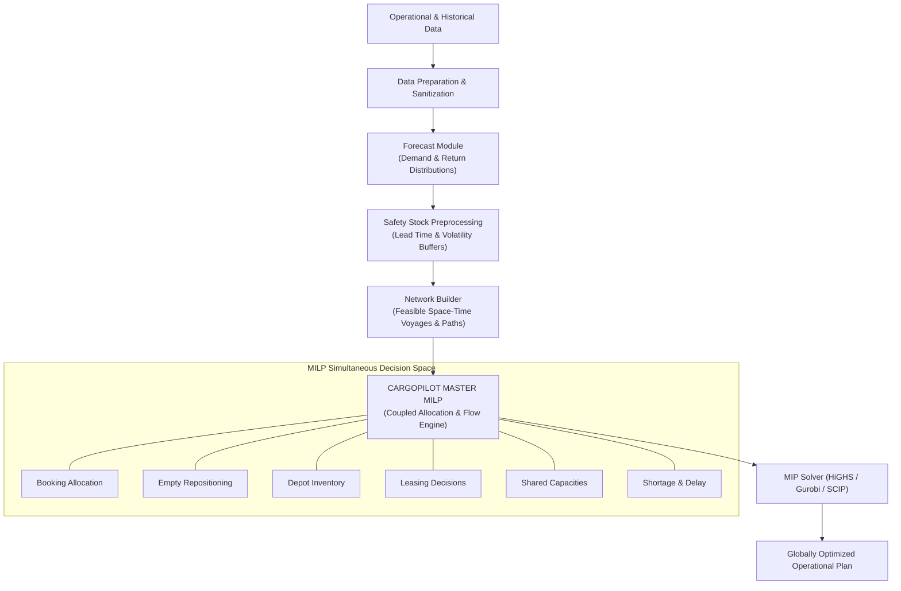
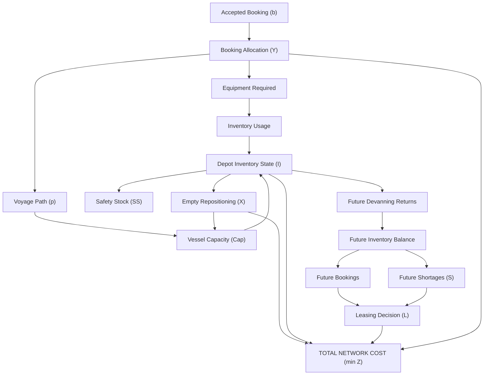

# CargoPilot — MILP Data & Equation Mapping
## Operational Pipeline & Mathematical Model Specification

- **Purpose:** Define the exact data parameters, decision variables, equation families, and literature origins for the CargoPilot Mixed-Integer Linear Program (MILP).

---

## 1. Operational End-to-End Pipeline



> [!NOTE]
> Forecasting and safety-stock sizing occur as **upstream preprocessing steps**. Their outputs become fixed deterministic parameters ($D_{i,k,t}, R_{i,k,t}, \text{SS}_{i,k,t}$) entering the MILP, mirroring the proven architecture of CSAV's ECO system.

---

## 2. Mathematical Sets & Indices

| Symbol | Meaning & Domain | Literature Source | V1 Status |
| :---: | :--- | :--- | :---: |
| $\mathcal{P}$ | Set of locations (ports, inland depots, rail ramps, yards) | ECO / Neely | `LOCKED` |
| $\mathcal{K}$ | Set of container equipment types (`20DC`, `40DC`, `40HC`, `REEFER`) | ECO / Neely | `LOCKED` |
| $\mathcal{T}$ | Set of discrete planning time periods ($t \in \{1, \dots, T\}$) | ECO / Neely | `LOCKED` |
| $\mathcal{V}$ | Set of scheduled voyages / vessel legs | ECO / Dong | `LOCKED` |
| $\mathcal{B}$ | Set of commercially accepted customer bookings | CargoPilot Scope | `LOCKED` |
| $\mathcal{P}_b$ | Set of candidate feasible paths for booking $b$ | Hu / Xiang | `LOCKED` |
| $\mathcal{M}$ | Transport modes (own vessel, chartered slot, rail, truck, barge) | ECO / Chang | `OPTIONAL` |
| $\mathcal{R}$ | Liner service loops / rotation routes | Dong / Xiang | `LOCKED` |

---

## 3. Input Parameters Catalogue

### 3.1 Inventory Parameters

| Parameter | Notation | Description | Source | V1 Status |
| :--- | :---: | :--- | :--- | :---: |
| **Initial Inventory** | $I^0_{i, k}$ | Usable empty containers of type $k$ available at location $i$ at $t=0$ | ECO / Neely | `LOCKED` |
| **In-Transit Pipeline** | $G_{i, k, t}$ | Containers already sailing, scheduled to arrive at location $i$ in period $t$ | ECO | `LOCKED` |
| **Storage Capacity** | $\text{StorageCap}_{i, k, t}$ | Physical storage cap for containers at location $i$ | Operational | `OPTIONAL` |

---

## 4. Forecast Parameters

| Parameter | Notation | Description | Source | V1 Status |
| :--- | :---: | :--- | :--- | :---: |
| **Empty Demand Forecast** | $D_{i, k, t}$ | Forecasted outbound container requirement | ECO / Neely | `LOCKED` |
| **Empty Return Forecast** | $R_{i, k, t}$ | Exogenous container returns from past consignees | ECO / Neely | `LOCKED` |
| **Demand Forecast Error** | $\mu^D_{i, k, t}, \sigma^D_{i, k, t}$ | Mean error and standard deviation of demand | ECO | `LOCKED` |
| **Return Forecast Error** | $\mu^R_{i, k, t}, \sigma^R_{i, k, t}$ | Mean error and standard deviation of returns | ECO | `LOCKED` |

---

## 5. Safety-Stock Preprocessing Calculation

Safety stock is precomputed prior to solving the MILP:

$$\text{SS}_{i, k, t} = f\left(\mu^D, \sigma^D, \mu^R, \sigma^R, \tau_{\text{lead}}, \sigma_{\text{vessel}}, z_\alpha\right)$$

In the MILP, safety stock forms a hard or penalized lower bound:

$$I_{i, k, t} \ge \text{SS}_{i, k, t}$$

---

## 6. Booking Parameters

| Parameter | Notation | Description | V1 Status |
| :--- | :---: | :--- | :---: |
| **Booking Quantity** | $Q_b$ | Number of containers demanded by booking $b$ | `LOCKED` |
| **Origin Location** | $o_b \in \mathcal{P}$ | Origin port / inland depot | `LOCKED` |
| **Destination Location** | $d_b \in \mathcal{P}$ | Destination port / inland depot | `LOCKED` |
| **Allowed Equipment** | $\mathcal{K}_b \subseteq \mathcal{K}$ | Compatible container types for booking $b$ | `LOCKED` |
| **Earliest Service Time** | $\text{ET}_b \in \mathcal{T}$ | Cargo-ready date / earliest pickup | `LOCKED` |
| **Latest Delivery Deadline** | $\text{LT}_b \in \mathcal{T}$ | Contractual arrival deadline | `LOCKED` |
| **Priority Tier** | $\text{prio}_b$ | Tier 1 (confirmed) to Tier 4 (speculative) | `LOCKED` |

---

## 7. Voyage Parameters

| Parameter | Notation | Description | Source |
| :--- | :---: | :--- | :--- |
| **Departure Period** | $\text{dep}_v$ | Scheduled departure time period | ECO / Dong |
| **Arrival Period** | $\text{arr}_v$ | Scheduled arrival time period | ECO / Dong |
| **TEU Capacity** | $\text{Cap}^{\text{TEU}}_v$ | Total TEU slot capacity of the vessel | Chang / ECO |
| **Weight Capacity** | $\text{Cap}^{\text{weight}}_v$ | Total deadweight container capacity | Chang |
| **Pre-Booked Capacity** | $\text{Booked}^{\text{TEU}}_v$ | Slots committed to third-party / external cargo | Operational |
| **Free Available Capacity** | $\text{Cap}^{\text{free}}_v = \text{Cap}^{\text{TEU}}_v - \text{Booked}^{\text{TEU}}_v$ | Net capacity available to CargoPilot | ECO / Chang |

---

## 8. Physical Container Parameters

| Parameter | Notation | Description | Source |
| :--- | :---: | :--- | :--- |
| **TEU Equivalent** | $\text{TEU}_k$ | Conversion factor ($1.0$ for 20DC, $2.0$ for 40DC/40HC) | Chang / ECO |
| **Tare & Cargo Weight** | $\text{Weight}_k$ | Average laden / empty weight per container type | Chang |
| **Volume Factor** | $\text{Volume}_k$ | Cubic volume (optional for high cubes) | Chang |

---

## 9. Transportation & Operational Cost Parameters

| Parameter | Notation | Description | Source |
| :--- | :---: | :--- | :--- |
| **Empty Repositioning Cost** | $c^{\text{empty}}_{i, j, k, v}$ | Cost per empty container moved from $i$ to $j$ on voyage $v$ | ECO / Neely |
| **Transit Duration** | $\tau^{\text{empty}}_{i, j, v}$ | Travel time between locations | ECO / Neely |
| **Lift-on Loading Cost** | $c^{\text{load}}_{i, k}$ | Terminal handling cost to load container onto vessel | ECO / Neely |
| **Lift-off Discharge Cost** | $c^{\text{unload}}_{i, k}$ | Terminal handling cost to discharge container | ECO / Neely |
| **Inventory Holding Cost** | $c^{\text{hold}}_{i, k, t}$ | Storage and per-diem holding cost per period | ECO |
| **Short-Term Leasing Cost** | $c^{\text{short}}_{i, k, t, p}$ | Spot / trip lease price along path $p$ | Hu et al. |
| **Long-Term Leasing Cost** | $c^{\text{long}}_{i, k, t}$ | Master term lease rental per period | Hu et al. |
| **Booking Delay Penalty** | $c^{\text{delay}}_b$ | Penalty per period of late delivery beyond $\text{LT}_b$ | CargoPilot |
| **Unserved Shortage Penalty** | $c^{\text{shortage}}_b$ | Severe economic penalty for unfulfilled booking | CargoPilot |
| **Safety Stock Penalty** | $c^{\text{SSshort}}_{i, k, t}$ | Penalty for dipping below safety stock threshold | ECO |

---

## 10. Decision Variables

| Variable | Notation | Domain | Operational Meaning | V1 Status |
| :--- | :---: | :---: | :--- | :---: |
| **Empty Inventory** | $I_{i, k, t}$ | $\mathbb{R}^+$ | Available empty containers at location $i$, type $k$, period $t$ | `LOCKED` |
| **Empty Repositioning** | $X_{i, j, k, v}$ | $\mathbb{Z}^+ \text{ or } \mathbb{R}^+$ | Empty containers repositioned from $i$ to $j$ on voyage $v$ | `LOCKED` |
| **Booking Allocation** | $Y_{b, p, k}$ | $\mathbb{Z}^+ \text{ or } \mathbb{R}^+$ | Quantity of booking $b$ fulfilled via path $p$ and container $k$ | `LOCKED` |
| **Short-Term Leased** | $L^{\text{short}}_{b, k, p}$ | $\mathbb{Z}^+ \text{ or } \mathbb{R}^+$ | Leased containers used to fulfill booking $b$ along path $p$ | `LOCKED` |
| **Long-Term Leased** | $L^{\text{long}}_{i, k, t}$ | $\mathbb{Z}^+ \text{ or } \mathbb{R}^+$ | Long-term leased containers injected at location $i$ | `DEFERRED` |
| **Unserved Booking** | $U_b$ | $\mathbb{R}^+$ | Slack variable for unfulfilled quantity of booking $b$ | `LOCKED` |
| **Booking Delay** | $\text{Delay}_b$ | $\mathbb{R}^+$ | Duration of delivery delay past deadline $\text{LT}_b$ | `LOCKED` |
| **Terminal Flow** | $\text{UP}_{i,k,t}, \text{DOWN}_{i,k,t}$ | $\mathbb{R}^+$ | Lift-on and lift-off terminal flows | `OPTIONAL` |

---

## 11. Core Mathematical Equation Families (1–20)

### Equation Family 1: Master Inventory Balance
$$I_{i, k, t+1} = I_{i, k, t} + R_{i, k, t} + G_{i, k, t} + \text{IN}_{i, k, t} - \text{OUT}_{i, k, t} - \text{Used}_{i, k, t}$$

Where:
- $\text{IN}_{i, k, t} = \sum_{j, v} X_{j, i, k, v} \quad (\text{Arriving empties})$
- $\text{OUT}_{i, k, t} = \sum_{j, v} X_{i, j, k, v} \quad (\text{Departing repositioned empties})$
- $\text{Used}_{i, k, t} = \sum_{b, p} Y_{b, p, k}^{\text{owned}} \quad (\text{Empties consumed by bookings})$

---

### Equation Family 2: Empty Flow Balance across Vessel Calls
$$\text{Unloaded}_{v, i, k} - \text{Loaded}_{v, i, k} = \text{InboundFlow}_{v, i, k} - \text{OutboundFlow}_{v, i, k}$$

---

### Equation Family 3: Booking Demand Fulfillment
$$\sum_{p \in \mathcal{P}_b} \sum_{k \in \mathcal{K}_b} Y_{b, p, k} + U_b = Q_b \quad \forall b \in \mathcal{B}$$

> [!IMPORTANT]
> CargoPilot does not decide whether to accept or reject bookings; it optimizes how commercially accepted bookings are routed and fulfilled.

---

### Equation Family 4: Origin Equipment Availability Bounds
$$\text{Used}_{i, k, t} + \sum_{j, v} X_{i, j, k, v} \le I_{i, k, t}$$

---

### Equation Family 5: Voyage TEU Slot Capacity Coupling
$$\sum_{b \in \mathcal{B}} \sum_{p \in \mathcal{P}_b} \sum_{k \in \mathcal{K}_b} \text{TEU}_k \cdot \mathcal{A}_{b, p, v} \cdot Y_{b, p, k} + \sum_{i, j \in \mathcal{P}} \sum_{k \in \mathcal{K}} \text{TEU}_k \cdot X_{i, j, k, v} \le \text{Cap}^{\text{free}}_v \quad \forall v \in \mathcal{V}$$

Where binary matrix $\mathcal{A}_{b, p, v} = 1$ if booking path $p$ traverses voyage leg $v$.

---

### Equation Family 6: Vessel Deadweight Capacity
$$\sum_{b, p, k} \text{Weight}^{\text{laden}}_k \cdot \mathcal{A}_{b, p, v} \cdot Y_{b, p, k} + \sum_{i, j, k} \text{Weight}^{\text{empty}}_k \cdot X_{i, j, k, v} \le \text{Cap}^{\text{weight}}_v \quad \forall v \in \mathcal{V}$$

---

### Equation Family 7: Safety Stock Maintenance
$$I_{i, k, t} + S^{\text{SS}}_{i, k, t} \ge \text{SS}_{i, k, t} \quad \forall i, k, t$$

Where $S^{\text{SS}}_{i, k, t} \ge 0$ is a penalized shortfall slack variable.

---

### Equation Family 8: Repositioning Move Authorization
$$X_{i, j, k, v} \le \text{AvailableEmpty}_{i, k, \text{dep}_v}$$

---

### Equation Family 9: Booking Timing & Delivery Windows
$$\text{Departure}_{b, p} \ge \text{ET}_b \quad \forall b, p$$

$$\text{Arrival}_{b, p} \le \text{LT}_b + \text{Delay}_b \quad \forall b, p$$

---

### Equation Family 10: Candidate Path Feasibility
Candidate paths $\mathcal{P}_b$ are generated by the upstream Network Builder, filtering out infeasible transit sequences before compiling the MILP.

---

### Equation Family 11: Short-Term Container Sourcing
$$Y_{b, p, k} = Y_{b, p, k}^{\text{owned}} + L_{b, p, k}^{\text{short}} \quad \forall b, p, k$$

$$\sum_{b} L_{b, p, k}^{\text{short}} \le \text{LeaseCap}^{\text{short}}_{o_b, k}$$

---

### Equation Family 12: Long-Term Leasing Integration
$$I_{i, k, t} \leftarrow I_{i, k, t} + L^{\text{long}}_{i, k, t}$$

---

### Equation Family 13: Booking Turnaround & Empty Return Flow
Laden containers delivered at destination $d_b$ return to the empty inventory pool after devanning turnaround duration $\tau^{\text{turn}}$:

$$\text{ReturnFromBooking}_{d_b, k, t + \tau^{\text{turn}}} = \sum_{p \in \mathcal{P}_b : \text{arr}_p = t} Y_{b, p, k}$$

---

### Equation Family 14: Terminal Storage Capacity Limit
$$I_{i, k, t} \le \text{StorageCap}_{i, k, t} \quad \forall i, k, t$$

---

### Equation Family 15: Dual Shortage Representation
CargoPilot explicitly separates commercial unfulfilled demand from depot inventory buffer deficits:
1. $U_b$: Commercial unserved booking shortage (High customer penalty)
2. $S^{\text{SS}}_{i, k, t}$: Internal safety-stock shortfall (Buffer risk penalty)

---

### Equation Family 16: Delivery Delay Penalties
$$\text{Delay}_b \ge \max\left(0, \text{Arrival}_{b, p} - \text{LT}_b\right) \quad \forall b, p$$

---

### Equation Family 17: Repositioning Cost
$$C_{\text{reposition}} = \sum_{i, j \in \mathcal{P}} \sum_{k \in \mathcal{K}} \sum_{v \in \mathcal{V}} c^{\text{empty}}_{i, j, k, v} \cdot X_{i, j, k, v}$$

---

### Equation Family 18: Inventory Holding Cost
$$C_{\text{inventory}} = \sum_{i \in \mathcal{P}} \sum_{k \in \mathcal{K}} \sum_{t \in \mathcal{T}} c^{\text{hold}}_{i, k, t} \cdot I_{i, k, t}$$

---

### Equation Family 19: Container Leasing Cost
$$C_{\text{lease}} = \sum_{b \in \mathcal{B}} \sum_{p \in \mathcal{P}_b} \sum_{k \in \mathcal{K}} c^{\text{short}} \cdot L^{\text{short}}_{b, k, p} + \sum_{i \in \mathcal{P}} \sum_{k \in \mathcal{K}} \sum_{t \in \mathcal{T}} c^{\text{long}} \cdot L^{\text{long}}_{i, k, t}$$

---

### Equation Family 20: Terminal Handling Cost
$$C_{\text{handling}} = \sum_{i, k, t} c^{\text{load}}_{i, k} \cdot \text{UP}_{i, k, t} + \sum_{i, k, t} c^{\text{unload}}_{i, k} \cdot \text{DOWN}_{i, k, t}$$

---

## 12. Master Objective Function

$$\begin{aligned}
\min \quad Z = & \sum_{i, j, k, v} c^{\text{empty}}_{i, j, k, v} X_{i, j, k, v} \\
& + \sum_{b, p, k} c^{\text{short}} L^{\text{short}}_{b, k, p} + \sum_{i, k, t} c^{\text{long}} L^{\text{long}}_{i, k, t} \\
& + \sum_{i, k, t} c^{\text{hold}}_{i, k, t} I_{i, k, t} \\
& + \sum_{i, k, t} \left( c^{\text{load}} \text{UP}_{i, k, t} + c^{\text{unload}} \text{DOWN}_{i, k, t} \right) \\
& + \sum_{b} c^{\text{delay}}_b \text{Delay}_b \\
& + \sum_{b} c^{\text{shortage}}_b U_b \\
& + \sum_{i, k, t} c^{\text{SSshort}}_{i, k, t} S^{\text{SS}}_{i, k, t}
\end{aligned}$$

---

## 13. Decision Dependency Architecture



---

## 14. Literature Source to Model Component Mapping

| CargoPilot Component | Primary Research Origin | Key Insight Reused |
| :--- | :--- | :--- |
| **Empty Inventory Conservation** | Neely (2008) / ECO (2012) | Inventory state equation with return and flow balance |
| **Empty Repositioning Arcs** | ECO (2012) / Neely (2008) | Multi-period vessel voyage flow variables |
| **Dynamic Safety Stock** | ECO (2012) | Precomputed bounds using forecast error distributions |
| **Shared Vessel Capacity** | Chang et al. (2014) / Dong (2009) | Simultaneous TEU and weight slot limits |
| **Path-Based Transshipment** | Hu et al. (2021) / Xiang (2024) | Precomputed multi-leg paths with transshipment |
| **Short vs. Long Leasing** | Hu et al. (2021) | Dual leasing mechanisms and marginal guide prices |
| **Booking Allocation Scope** | CargoPilot Adaptation | Cost-minimization routing for accepted bookings |
| **Robust Uncertainty & CCG** | Xiang et al. (2024) | Two-stage robust decomposition roadmap (Phase 2 / V2) |

---

## 15. Implementation Prerequisites & Small Prototype Plan

Before writing large-scale production code, validate the formulation against a hand-calculable micro-instance:

```text
3 Ports (Shanghai, Los Angeles, Rotterdam)
2 Container Types (20DC, 40HC)
4 Scheduled Voyages
4 Planning Time Periods (Weeks 1–4)
3 Accepted Commercial Bookings
```

### Validation Workflow
1. Manually compute the exact primal solution and cost $Z^*$.
2. Instantiate the MILP in Python (`Pyomo` / `OR-Tools`) with `HiGHS` / `Gurobi`.
3. Verify that the solver reaches the exact identical objective ($Z_{\text{solver}} = Z^*$) with $\text{Gap} = 0.0\%$.
4. Scale up to the production database and rolling-horizon pipeline.