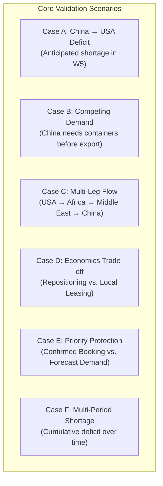
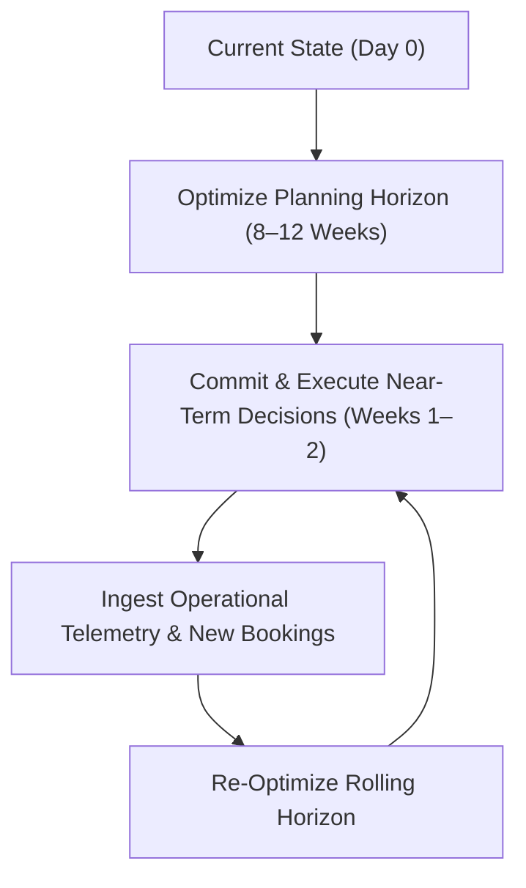
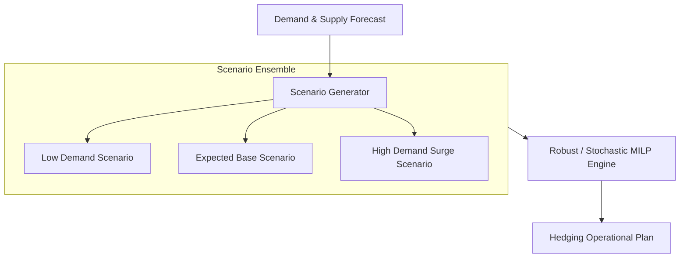
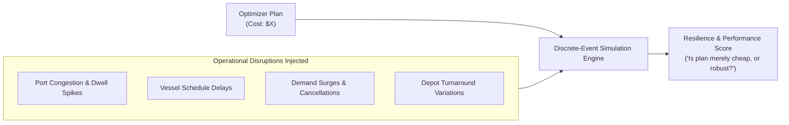

# CargoPilot Optimization Plan
## End-to-End Development Roadmap (Phases 1–9)

- **Purpose:** Define the step-by-step engineering and research roadmap for designing, implementing, benchmarking, scaling, and validating the CargoPilot Optimization Engine.

---

## Roadmap Overview

```mermaid
flowchart LR
    P1["Phase 1<br/>Foundation Selection"] --> P2["Phase 2<br/>Requirements Mapping"]
    P2 --> P3["Phase 3<br/>Mathematical Model"]
    P3 --> P4["Phase 4<br/>Small Exact Optimizer"]
    P4 --> P5["Phase 5<br/>Optimality Benchmarking"]
    P5 --> P6["Phase 6<br/>Rolling Horizon"]
    P6 --> P7["Phase 7<br/>Uncertainty Layer"]
    P7 --> P8["Phase 8<br/>Scale-Up & Decomposition"]
    P8 --> P9["Phase 9<br/>Simulation & Validation"]
```



---

## Phase 1 — Foundation Selection

Identify and select the closest established Operations Research formulation for CargoPilot.

### Core Evaluation Areas
- Empty-container repositioning (ECR)
- Multi-period container inventory conservation
- Joint laden and empty container flows
- Voyage capacity allocation (TEU slots and deadweight)
- Booking fulfillment and assignment
- Container leasing and acquisition decisions
- Future strategic positioning
- Emergent multi-leg repositioning
- Demand uncertainty integration

> **Output:** A proven mathematical formulation selected as CargoPilot's core foundation (Multi-Period Multi-Commodity Network-Flow MILP).

---

## Phase 2 — Requirements Mapping

Map the specific CargoPilot operational requirements and business cases (Cases 1–15) against established OR formulations to distinguish what can be reused directly versus what requires extension.

### Mapping Matrix

| CargoPilot Requirement | Existing Formulation Concept | Modification / Extension Needed |
| :--- | :--- | :---: |
| **Existing Confirmed Bookings** | Demand conservation constraints | `Maybe / Minor` |
| **Empty Container Repositioning** | Arc network flow variables ($e_{ijkt}$) | `Reuse` |
| **Future Shortage Resolution** | Multi-period inventory-demand balance | `Reuse` |
| **Container Leasing / Off-Hire** | External procurement decision variables | `Add` |
| **Voyage Capacity Constraints** | Vessel slot & deadweight capacity bounds | `Reuse` |
| **Multi-Leg Repositioning** | Multi-hop network flow paths across time | `Reuse` |
| **Future Strategic Positioning** | Multi-period terminal inventory valuation | `Extend` |
| **Tiered Booking Priorities** | Multi-level penalty & disruption costs | `Add` |

> **Output:** A clear delta specification defining exactly what is reused from literature and what custom modules CargoPilot must construct.

---

## Phase 3 — Mathematical Model Specification

Formally specify the complete mathematical model before writing solver code.

### 1. Sets & Indices
- $\mathcal{P}$: Ports and inland depots ($p \in \mathcal{P}$)
- $\mathcal{V}$: Scheduled voyages and service loops ($v \in \mathcal{V}$)
- $\mathcal{T}$: Discrete planning time periods / weeks ($t \in \mathcal{T}$)
- $\mathcal{K}$: Container equipment types ($k \in \mathcal{K}$, e.g., 20DC, 40DC, 40HC, Reefer)
- $\mathcal{B}$: Commercial customer bookings ($b \in \mathcal{B}$)
- $\mathcal{D}$: Priority classes and demand tiers ($d \in \mathcal{D}$)

### 2. Parameters & Coefficients
- $\text{Inv}_{p, k, 0}$: Initial available container inventory at port $p$
- $\text{Dem}_{b, p, k, t}$: Container demand from booking $b$
- $\text{Cap}_{v, t}$: Vessel slot capacity for voyage $v$
- $\tau_{u, v}$: Transit duration between port nodes
- $c^{\text{repo}}$: Empty repositioning cost per TEU-mile
- $c^{\text{lease}}$: Container leasing and per-diem costs
- $c^{\text{hand}}$: Terminal lift-on / lift-off handling costs
- $c^{\text{short}}$: Penalty cost for unmet or deferred demand
- $w_{d}$: Priority weighting multiplier for demand class $d$

### 3. Decision Variables
- $x_{v, k, t} \ge 0$: Number of laden containers of type $k$ loaded onto voyage $v$ at period $t$
- $e_{i, j, k, t} \ge 0$: Number of empty containers of type $k$ repositioned from $i$ to $j$ at period $t$
- $I_{p, k, t} \ge 0$: Available inventory of container type $k$ at port $p$ at the end of period $t$
- $L_{p, k, t} \ge 0$: Number of containers leased at port $p$ in period $t$
- $S_{b, t} \ge 0$: Unfulfilled demand / shortage for booking $b$ at period $t$
- $y_{b, v, k} \in \{0, 1\}$: (Optional) Binary assignment variable of booking $b$ to specific voyage $v$ and equipment $k$

---

## Phase 4 — Small Exact Optimizer Prototype

Build and solve a targeted prototype on a representative sub-network rather than starting with the global fleet.

### Prototype Scope
- **Network Size:** 5–10 Ports, 10–30 Voyages, 2–4 Container Types, 4–8 Week Horizon
- **Candidate Solvers:** `HiGHS`, `SCIP`, `Gurobi`, `Google OR-Tools`

### Fundamental Benchmark Test Cases



---

## Phase 5 — Validation Against Known Optimum

Establish a rigorous scientific benchmark for solution quality.

$$\text{Optimality Gap} = \frac{|\text{Solution Cost} - \text{Exact Optimum}|}{\text{Exact Optimum}} \times 100\%$$

- **Exact Benchmark:** Solve prototype instances to proven global optimality ($\text{Gap} = 0.0\%$).
- **Algorithm Comparison:** When developing heuristics, candidate-path pruning, or decomposition techniques, evaluate their performance against this known exact baseline.

---

## Phase 6 — Rolling-Horizon Execution

Transition the static optimization model into an operational, dynamic planning system.



- Ingest live booking arrivals, gate events, delays, and revised forecasts.
- Freeze executed decisions and re-optimize the forward-looking horizon iteratively.

---

## Phase 7 — Uncertainty Layer

Incorporate demand and operational variability without compromising the core deterministic solver.



1. **Step 1:** Scenario-based sensitivity analysis (Low / Expected / High demand).
2. **Step 2:** Two-stage stochastic programming or robust optimization with bounded uncertainty sets.

---

## Phase 8 — Scale-Up & Decomposition

Scale the optimization engine to handle full carrier global networks (hundreds of ports, thousands of voyages).

```text
Full Global Network Graph
          │
          ▼
Candidate-Path Pruning (Prune 40–60% inferior routes)
          │
          ▼
MIP Solver Scale Check ──► [Solves within SLA?] ──► YES ──► Production MILP
          │
          NO
          ▼
Advanced Decomposition Techniques:
  ├── Column Generation (Path-based container routing)
  ├── Benders Decomposition (Master allocation + flow subproblems)
  ├── Branch-and-Price (Integer column generation)
  └── Targeted Heuristics (Warm starts & local search)
```

> [!NOTE]
> Complexity is added strictly when required by real-world network scale and runtime SLAs.

---

## Phase 9 — Simulation & Stress Testing

Validate operational resilience before executing plans in the field.



---

## Final CargoPilot Architecture

```text
                                CARGOPILOT
                                     │
                                     ▼
                          Historical & Live Data
                                     │
                                     ▼
                          Demand / Supply Forecast
                                     │
                                     ▼
                        TIME-EXPANDED NETWORK
                                     │
                                     ▼
                      MULTI-COMMODITY MILP MODEL
                                     │
                                     ▼
                                 MIP SOLVER
                                     │
                                     ▼
                        Optimal / Near-Optimal Plan
                                     │
                                     ▼
                            ROLLING HORIZON
                                     │
                                     ▼
                          Execute Near-Term Plan
                                     │
                                     ▼
                               Live Telemetry ──► [Re-Optimize]
```

### Phase Summary Matrix

| Phase | Milestone | Focus | Deliverable | Status |
| :---: | :--- | :--- | :--- | :---: |
| **1** | **Foundation Selection** | Evaluate literature & algorithms | Selected base formulation | `CLOSED` |
| **2** | **Requirements Mapping** | Map CargoPilot cases 1–15 | Specification delta matrix | `NEXT` |
| **3** | **Mathematical Model** | Define sets, variables, equations | Formal mathematical formulation | `PLANNED` |
| **4** | **Small Exact Optimizer** | Build prototype & test cases | Working benchmark solver | `PLANNED` |
| **5** | **Optimality Benchmarking** | Measure MIP gap & solve times | Verification baseline | `PLANNED` |
| **6** | **Rolling Horizon** | Dynamic time-stepping execution | Operational controller | `PLANNED` |
| **7** | **Uncertainty Layer** | Scenario & robust optimization | Stochastic handling module | `PLANNED` |
| **8** | **Scale-Up Methods** | Decomposition & path reduction | Scalable enterprise engine | `PLANNED` |
| **9** | **Simulation Engine** | Stress-test plans against delays | Validation & resilience suite | `PLANNED` |
