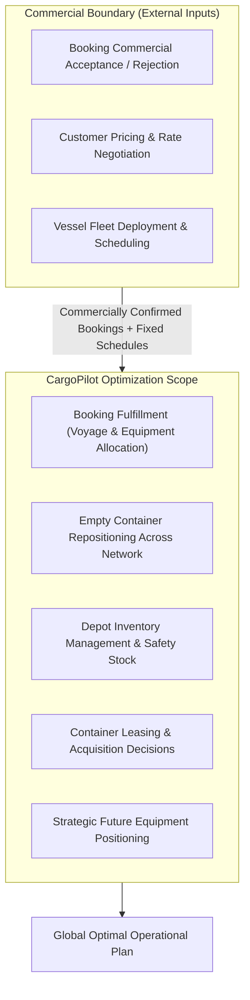
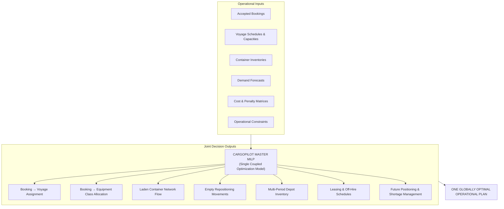
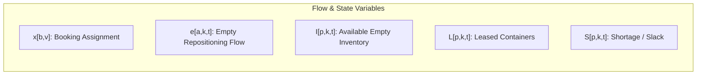
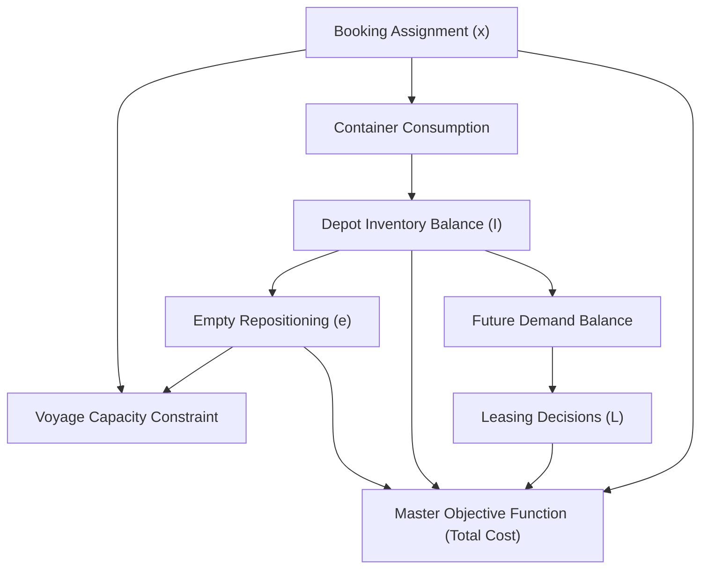
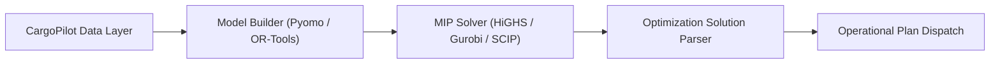

# CargoPilot Optimization Engine
## Phase 2 — Mathematical Model & Optimization Design

- **Status:** Phase 2 — Active Design
- **Phase 1 Status:** `Complete` (Foundation Selected: Multi-Period Multi-Commodity Time-Expanded MILP)
- **Purpose:** Define the single integrated mathematical optimization model that serves as the blueprint for the CargoPilot optimization engine.

---

## 1. Phase 2 Objective

The objective of Phase 2 is to specify a **single integrated mathematical optimization model** for CargoPilot.

CargoPilot must evaluate operational decisions **jointly** rather than running fragmented, isolated sub-optimizers for bookings, container allocation, empty repositioning, depot inventory, and leasing.

The model determines the economically optimal global network plan while respecting:
- Accepted commercial bookings and delivery deadlines
- Fixed vessel schedules and available voyage capacities (TEU / weight)
- Current container fleet inventory by location and equipment type
- Forward-looking rolling demand forecasts and expected return flows
- Network repositioning routes and multi-leg transit possibilities
- Container leasing contracts, availability, and off-hire rules
- Port/depot storage constraints and safety-stock thresholds
- Operational equipment compatibility and substitution rules

> **Implementation Target:** A single coupled Mixed-Integer Linear Program (MILP).

---

## 2. CargoPilot Optimization Boundary



### 2.1 Decisions Outside CargoPilot (External Inputs)
The following decisions are strictly outside CargoPilot V1:
- Whether a customer booking request is commercially accepted or rejected
- Customer pricing, freight tariffs, and rate negotiations
- Vessel fleet deployment, service routing, and voyage scheduling
- Carrier long-term fleet sizing and capital purchases

### 2.2 Decisions Made by CargoPilot
Once bookings are commercially confirmed and entering the system, CargoPilot optimizes:

| Decision Domain | Operational Decisions Handled by CargoPilot |
| :--- | :--- |
| **Booking Fulfillment** | • Which feasible voyage carries each booking<br>• Whether a booking is split across multiple voyages (if permitted)<br>• Which equipment type and origin depot fulfills the booking |
| **Equipment Management** | • Which empty containers must be repositioned<br>• Destination, route, and voyage for repositioned equipment<br>• When empty equipment should move<br>• How many containers to lease at each location |
| **Inventory & Positioning** | • How much inventory to hold at each port/depot across time<br>• Preserving equipment for high-value future bookings<br>• Economic trade-off between repositioning vs. local leasing<br>• Emergent multi-leg repositioning trajectories |

---

## 3. Core Optimization Architecture

CargoPilot combines multi-commodity flow, inventory theory, and slot allocation into **one coupled master MILP**.



```text
Accepted Bookings + Voyage Network + Container Inventory + Forecasts + Costs + Constraints
                                      │
                                      ▼
                       ┌─────────────────────────────┐
                       │   CargoPilot Master MILP    │
                       └──────────────┬──────────────┘
                                      │
        ┌──────────────┬──────────────┼──────────────┬──────────────┐
        ▼              ▼              ▼              ▼              ▼
Booking → Voyage  Booking → Eq.  Empty Repo.   Inventory & Lease Future Plan
        │              │              │              │              │
        └──────────────┴──────────────┼──────────────┴──────────────┘
                                      ▼
                        ONE GLOBAL OPERATIONAL PLAN
```

---

## 4. Why a Single Optimization Model?

Decisions in container logistics are tightly coupled. Optimizing them independently causes local sub-optimization:

```text
Assign Booking B
       │
       ▼
Container C is consumed at origin depot
       │
       ▼
Origin inventory drops below required threshold
       │
       ▼
Risk of future local export shortage increases
       │
       ▼
Repositioning from alternate depot required
       │
       ▼
Consumes vessel slot capacity on future voyage
       │
       ▼
Forces high-cost emergency leasing at destination
       │
       ▼
Total Network Operational Cost Escalates
```

> [!IMPORTANT]
> Because every equipment allocation directly alters future inventory balances and voyage capacities, all decisions must be visible simultaneously to one optimization engine.

---

## 5. Mathematical Model Structure

```text
Sets & Indices ──► Parameters ──► Decision Variables ──► Objective Function ──► Constraints ──► Variable Domains
```

---

## 6. Sets and Indices

| Set Symbol | Name | Description & Examples |
| :---: | :--- | :--- |
| $\mathcal{P}$ | **Locations** | Set of ports, inland depots, terminals, and container yards ($p \in \mathcal{P}$) |
| $\mathcal{T}$ | **Time Periods** | Discrete planning intervals: days, weeks, or planning periods ($t \in \mathcal{T} = \{1, \dots, T\}$) |
| $\mathcal{K}$ | **Container Types** | Distinct equipment commodities: `20GP`, `40GP`, `40HC`, `45HC`, `REEFER` ($k \in \mathcal{K}$) |
| $\mathcal{V}$ | **Voyages** | Set of scheduled vessel voyage legs with fixed origins, destinations, and dates ($v \in \mathcal{V}$) |
| $\mathcal{A}$ | **Network Arcs** | Directed space-time arcs representing voyages, repositioning, and drayage moves ($a \in \mathcal{A}$) |
| $\mathcal{B}$ | **Bookings** | Set of commercially accepted customer bookings requiring fulfillment ($b \in \mathcal{B}$) |
| $\mathcal{D}$ | **Priority Tiers** | Booking priority and service tiers ($d \in \mathcal{D} = \{\text{Tier 1}, \text{Tier 2}, \text{Tier 3}, \text{Tier 4}\}$) |

---

## 7. Booking Inputs

For every accepted commercial booking $b \in \mathcal{B}$:

| Parameter | Notation | Description |
| :--- | :---: | :--- |
| **Booking ID** | $\text{ID}_{b}$ | Unique identifier |
| **Origin Location** | $o_{b} \in \mathcal{P}$ | Port or inland terminal of cargo origin |
| **Destination Location** | $d_{b} \in \mathcal{P}$ | Port or inland terminal of cargo destination |
| **Required Equipment** | $k_{b} \in \mathcal{K}$ | Required container type (e.g., `40HC`) |
| **Booking Quantity** | $Q_{b}$ | Number of containers demanded |
| **Cargo-Ready Time** | $r_{b} \in \mathcal{T}$ | Earliest time cargo is available for stuffing/loading |
| **Latest Delivery Deadline** | $\text{DD}_{b} \in \mathcal{T}$ | Contractual arrival deadline at destination |
| **Priority / Class** | $\text{prio}_{b} \in \mathcal{D}$ | Commercial priority tier |
| **Splitting Allowed** | $\text{split}_{b} \in \{0, 1\}$ | Flag indicating whether booking can be split across multiple voyages |

---

## 8. Voyage Inputs

For every scheduled voyage leg $v \in \mathcal{V}$:

| Parameter | Notation | Description |
| :--- | :---: | :--- |
| **Voyage ID** | $\text{ID}_{v}$ | Unique voyage/service identifier |
| **Origin Port** | $o_{v} \in \mathcal{P}$ | Port of loading |
| **Destination Port** | $d_{v} \in \mathcal{P}$ | Port of discharge |
| **Departure Period** | $\text{dep}_{v} \in \mathcal{T}$ | Scheduled time of departure |
| **Arrival Period** | $\text{arr}_{v} \in \mathcal{T}$ | Scheduled time of arrival |
| **Available Slot Capacity** | $\text{Cap}^{\text{TEU}}_{v}$ | Total available TEU slot capacity allocated to CargoPilot |
| **Available Weight Capacity** | $\text{Cap}^{\text{WT}}_{v}$ | Deadweight container capacity available on the leg |
| **Equipment Restrictions** | $\text{Restr}_{v, k}$ | Operational limits (e.g., maximum reefer plugs available) |

---

## 9. Container & Inventory Inputs

For each location $p \in \mathcal{P}$, container type $k \in \mathcal{K}$, and time period $t \in \mathcal{T}$:

| Parameter | Notation | Description |
| :--- | :---: | :--- |
| **Initial Inventory** | $\text{Inv}_{p, k, 0}$ | Known available empty containers at period $t=0$ |
| **Maximum Storage Capacity** | $\text{Cap}^{\text{inv}}_{p}$ | Depot/terminal physical storage limit |
| **Safety Stock Threshold** | $\text{SS}_{p, k, t}$ | Minimum target buffer inventory to guard against volatility |
| **Expected Turnaround Delay** | $\delta^{\text{turn}}_{p, k}$ | Average duration between cargo arrival and empty return |

---

## 10. Future Demand Inputs

For each location $p$, equipment type $k$, and period $t$:
- $\text{Dem}^{\text{fcst}}_{p, k, t}$: Expected demand from unconfirmed/future forecast bookings
- $\text{Ret}^{\text{fcst}}_{p, k, t}$: Expected container returns from previously discharged laden shipments
- $\text{Conf}_{p, k, t}$: Forecast confidence score ($0.0 \le \text{Conf} \le 1.0$)

> [!NOTE]
> Future demand enters the model as soft demand targets or multi-period inventory valuations rather than hard infeasibility triggers.

---

## 11. Cost Parameters

The objective relies on transparent monetary costs and penalty equivalents:

| Cost Component | Symbol | Unit | Description |
| :--- | :---: | :---: | :--- |
| **Empty Repositioning** | $c^{\text{repo}}_{a, k}$ | \$/TEU | Freight, bunker, and slot cost for empty repositioning |
| **Laden Transport** | $c^{\text{laden}}_{v, k}$ | \$/TEU | Variable operational transport cost per laden container |
| **Handling / Stevedoring** | $c^{\text{hand}}_{p, k}$ | \$/move | Lift-on / lift-off (LoLo) and gate charges at terminals |
| **Inventory Holding** | $c^{\text{inv}}_{p, k}$ | \$/TEU/period | Storage fees, depot per-diem, and opportunity holding cost |
| **Container Leasing** | $c^{\text{lease}}_{p, k}$ | \$/container | Direct lease pickup charges and daily rental rates |
| **Demand Shortage Penalty** | $c^{\text{short}}_{d}$ | \$/TEU | Tiered penalty for unfulfilled/deferred demand ($c^{\text{short}}_{\text{Tier 1}} \gg c^{\text{short}}_{\text{Tier 4}}$) |
| **Late Delivery Penalty** | $c^{\text{late}}_{b}$ | \$/period | Contractual penalty per period of arrival delay |

---

## 12. Core Decision Variables



### 12.1 Booking-to-Voyage Allocation ($x_{b, v}$)
- **Non-splittable Bookings:** Binary variable $x_{b, v} \in \{0, 1\}$, indicating whether booking $b$ is assigned to voyage $v$.
- **Splittable Bookings:** Continuous variable $x_{b, v} \ge 0$, representing the quantity of booking $b$ assigned to voyage $v$.

### 12.2 Booking-to-Equipment Allocation
- Quantities of container type $k$ allocated to booking $b$ from origin depot $p$.
- Aggregated by equipment type for tractability in V1.

### 12.3 Laden Container Flow
- Flows of laden containers across voyage arcs, coupling booking demand with vessel slot consumption and destination equipment inflows.

### 12.4 Empty Container Repositioning ($e_{a, k, t}$)
- Integer/continuous variable $e_{a, k, t} \ge 0$ representing the number of empty containers of type $k$ repositioned on network arc $a$ departing at period $t$.

### 12.5 Inventory State Variable ($I_{p, k, t}$)
- Continuous variable $I_{p, k, t} \ge 0$ representing available empty equipment at location $p$ at the end of period $t$.

### 12.6 Container Leasing ($L_{p, k, t}$)
- Integer/continuous variable $L_{p, k, t} \ge 0$ representing containers leased at location $p$ in period $t$.

### 12.7 Shortage & Service Slack ($S_{b}$ / $S_{p, k, t}$)
- Slack variables representing unfulfilled demand, heavily penalized in the objective to guarantee solver feasibility.

---

## 13. Core Mathematical Constraints

### 13.1 Booking Fulfillment Constraint
Every accepted booking $b \in \mathcal{B}$ must be completely fulfilled:

$$\sum_{v \in \mathcal{V}^{\text{feas}}(b)} x_{b, v} = 1 \quad \forall b \in \mathcal{B} \quad (\text{Non-splittable})$$

$$\sum_{v \in \mathcal{V}^{\text{feas}}(b)} x_{b, v} = Q_{b} \quad \forall b \in \mathcal{B} \quad (\text{Splittable})$$

Where $\mathcal{V}^{\text{feas}}(b)$ is the set of voyages matching origin $o_b$, destination $d_b$, and satisfying $r_b \le \text{dep}_v$ and $\text{arr}_v \le \text{DD}_b$.

### 13.2 Voyage Capacity Constraint
Combined laden shipments and empty repositioning cannot exceed available voyage slot capacity:

$$\sum_{b \in \mathcal{B} : v \in \mathcal{V}^{\text{feas}}(b)} \text{TEU}(k_b) \cdot x_{b, v} + \sum_{k \in \mathcal{K}} \text{TEU}(k) \cdot e_{v, k, \text{dep}_v} \le \text{Cap}^{\text{TEU}}_{v} \quad \forall v \in \mathcal{V}$$

> **Coupling Effect:** Laden cargo and empty repositioning compete directly for the same scarce vessel capacity.

### 13.3 Container Availability & Inventory Balance
For every location $p$, equipment type $k$, and period $t$:

$$I_{p, k, t} = I_{p, k, t-1} + \text{Inflows}(p, k, t) - \text{Outflows}(p, k, t)$$

Where:
$$\text{Inflows}(p, k, t) = \sum_{a \in \mathcal{A}^{\text{in}}(p)} e_{a, k, t - \tau_a} + \text{Ret}_{p, k, t} + L_{p, k, t}$$

$$\text{Outflows}(p, k, t) = \sum_{b \in \mathcal{B} : o_b = p, r_b = t, k_b = k} Q_b \cdot x_{b, v} + \sum_{a \in \mathcal{A}^{\text{out}}(p)} e_{a, k, t}$$

### 13.4 Voyage Timing & Network Feasibility
Containers departing on voyage $v$ at $\text{dep}_v$ become available at destination $d_v$ strictly at:

$$t_{\text{avail}} = \text{arr}_v + \tau^{\text{discharge}}$$

### 13.5 Delivery Deadline Enforcement
$$\text{arr}_v \cdot x_{b, v} \le \text{DD}_b \quad \forall b \in \mathcal{B}, \forall v \in \mathcal{V}^{\text{feas}}(b)$$

### 13.6 Equipment Compatibility
Bookings must be assigned only to compatible container types:

$$x_{b, v, k} = 0 \quad \text{if } k \notin \text{Compatible}(k_b)$$

### 13.7 Storage Capacity & Safety Stock Bounds
$$\text{SS}_{p, k, t} - S^{\text{SS}}_{p, k, t} \le I_{p, k, t} \le \text{Cap}^{\text{inv}}_{p, k} \quad \forall p, k, t$$

### 13.8 Leasing Limits
$$L_{p, k, t} \le \text{MaxLease}_{p, k, t} \quad \forall p, k, t$$

---

## 14. Master Objective Function

$$\begin{aligned}
\min \quad Z = & \sum_{a \in \mathcal{A}} \sum_{k \in \mathcal{K}} \sum_{t \in \mathcal{T}} c^{\text{repo}}_{a, k} \cdot e_{a, k, t} \\
& + \sum_{p \in \mathcal{P}} \sum_{k \in \mathcal{K}} \sum_{t \in \mathcal{T}} c^{\text{inv}}_{p, k} \cdot I_{p, k, t} \\
& + \sum_{p \in \mathcal{P}} \sum_{k \in \mathcal{K}} \sum_{t \in \mathcal{T}} c^{\text{lease}}_{p, k} \cdot L_{p, k, t} \\
& + \sum_{p \in \mathcal{P}} \sum_{k \in \mathcal{K}} \sum_{t \in \mathcal{T}} c^{\text{hand}}_{p, k} \cdot (\text{Inflows} + \text{Outflows}) \\
& + \sum_{b \in \mathcal{B}} c^{\text{short}}_{d(b)} \cdot S_{b} \\
& + \sum_{b \in \mathcal{B}} c^{\text{late}}_{b} \cdot \max(0, \text{arr}_{v(b)} - \text{DD}_{b})
\end{aligned}$$

---

## 15. Priority Handling Strategy

Priority tiers are enforced through calibrated economic penalties rather than isolated lexicographical objectives:

```text
Tier 1: Confirmed Bookings       ──► Penalty: $25,000 / TEU (Zero voluntary shortage)
Tier 2: High-Confidence Forecast ──► Penalty: $5,000 / TEU
Tier 3: Normal Rolling Forecast  ──► Penalty: $1,500 / TEU
Tier 4: Low-Confidence Forecast  ──► Penalty: $500 / TEU
```

---

## 16. Cost Calibration Hierarchy

```text
1. Real Monetary Costs ($/TEU, $/move, $/day)
        │
        ▼
2. Economic Penalty Equivalents (Shortage, delay, stockout risk)
        │
        ▼
3. Policy & Tie-Breaking Weights (Minimal mathematical epsilon)
```

---

## 17. Sensitivity Analysis

Cost and penalty parameters will be systematically tested across wide ranges:
- Shortage penalties: $\$2,000 \to \$5,000 \to \$10,000 \to \$25,000$
- If the optimal plan remains identical, exact penalty calibration is insensitive.
- If decisions shift, the boundary identifies critical operational trade-off thresholds.

---

## 18. Literature Reused

| Formulation Family | Reused Foundation | Specific CargoPilot Application |
| :--- | :--- | :--- |
| **CSAV / ECO System** | Multi-period multi-commodity flow + safety stock | Base container inventory & repositioning equations |
| **Slot Allocation Models** | Laden cargo assignment on container vessels | Booking-to-voyage allocation & slot limits |
| **Maritime ECR Formulations** | Time-expanded network flow models | Empty container movement across port networks |
| **Integrated Booking Models** | Joint revenue & equipment assignment | Coupling booking fulfillment with equipment inventory |

---

## 19. Source Equation Integration Pipeline

```text
Academic & Industry Formulations
              │
              ▼
Extract Variables, Parameters & Assumptions
              │
              ▼
Adapt to CargoPilot Operational Rules
              │
              ▼
Couple Subsystems via Shared Decision Variables
              │
              ▼
Single Coupled Master MILP Formulation
```

---

## 20. Equation Dependency Architecture



---

## 21. Time-Expanded Network Trajectory

Multi-leg repositioning emerges naturally over time without hardcoded rules:

```text
Shanghai (W1) ──[Voyage]──► Los Angeles (W3) ──[Reposition]──► Africa (W6) ──[Voyage]──► Middle East (W8)
```

---

## 22. Rolling-Horizon Control Framework

```text
Today (T0)
  ├── Optimize Full Horizon (8–12 Weeks)
  ├── Commit & Execute Near-Term Operational Orders (Weeks 1–2)
  │
  ▼
Ingest Live Feedback (Gate events, schedule delays, new bookings)
  │
  ▼
Re-Optimize Rolling Horizon
```

---

## 23. Deterministic V1 Principle

- CargoPilot V1 is **strictly deterministic**: inputs (schedules, bookings, inventories, costs) are treated as known.
- Stochastic and robust optimization layers are added only after the deterministic core is proven.

---

## 24. Deferred Advanced Optimization

The following techniques are explicitly deferred to post-V1 phases:
- Stochastic programming and robust uncertainty sets
- Reinforcement learning and dynamic policy search
- Genetic algorithms and metaheuristics
- Column Generation, Benders Decomposition, and Branch-and-Price

---

## 25. Solver Decoupling Strategy



> **Design Rule:** The solver must remain a pluggable component decoupled from CargoPilot business schemas.

---

## 26. Required Input Categories

```text
1. NETWORK: Locations, voyages, schedules, capacities, transit times
2. BOOKINGS: Demands, origins, destinations, equipment types, quantities, deadlines, priorities
3. EQUIPMENT: Fleet inventories, depot storage caps, safety stock targets
4. DEMAND FORECASTS: Future demand distributions, expected laden returns
5. OPERATIONAL COSTS: Freight rates, handling fees, holding costs, leasing per-diems, shortage penalties
6. BUSINESS RULES: Container compatibility, splitting rules, contract constraints
```

---

## 27. Expected Output Schema

The optimization plan produced must specify:
1. **Booking Allocation:** $\text{Booking} \to (\text{Selected Voyage}, \text{Assigned Equipment}, \text{Quantity})$
2. **Equipment Repositioning:** $(\text{Equipment Type}, \text{Origin}, \text{Destination}, \text{Voyage Arc}, \text{Quantity}, \text{Timing})$
3. **Inventory Trajectory:** $(\text{Location}, \text{Equipment Type}, \text{Projected Balance over Time})$
4. **Leasing Schedule:** $(\text{Location}, \text{Equipment Type}, \text{Quantity Leased}, \text{Period})$
5. **Future Strategic Positioning:** Projected surpluses, anticipated deficit warnings, proactive moves
6. **Financial Metrics:** Total operational cost, cost breakdown, service fulfillment rate, capacity utilization

---

## 28. Validation Strategy (Small Test Cases)

| Test Case | Scenario Scope | Validation Objective |
| :---: | :--- | :--- |
| **Test 1** | 2 ports, 1 container type, 1 booking, 1 voyage | Baseline sanity check: exact allocation |
| **Test 2** | 2 ports, multiple voyages with different departures | Verifies voyage selection by departure and cost |
| **Test 3** | Multiple container types ($20\text{DC}, 40\text{HC}$) | Verifies commodity separation and non-substitution |
| **Test 4** | Competing bookings, constrained voyage capacity | Verifies priority rationing and slot allocation |
| **Test 5** | Future anticipated deficit | Verifies proactive multi-period repositioning |
| **Test 6** | High repositioning cost vs. cheap leasing | Verifies economic trade-off between repo and leasing |
| **Test 7** | Multi-leg network ($A \to B \to C \to A$) | Verifies emergent multi-leg repositioning |
| **Test 8** | Multi-period full benchmark instance | Proves global optimality gap $= 0.0\%$ |

---

## 29. Phase 2 Deliverables Checklist

- [x] 1. Complete mathematical formulation specification
- [x] 2. Complete set and index catalogue
- [x] 3. Complete parameter catalogue
- [x] 4. Complete decision-variable catalogue
- [x] 5. Master objective function formulation
- [x] 6. Complete constraint equation set
- [x] 7. Source literature $\to$ equation mapping
- [x] 8. CargoPilot-specific adaptations
- [x] 9. Input data schema specification
- [x] 10. Output plan schema specification
- [x] 11. Solver decoupling strategy
- [x] 12. Small benchmark validation suite (Tests 1–8)
- [x] 13. V1 boundary and limitation definitions

---

## 30. Phase 2 Completion Criteria

Phase 2 is complete when every operational decision connects through an unbroken mathematical chain:

$$\text{Input Data} \longrightarrow \text{Decision Variable} \longrightarrow \text{Flow/Capacity Constraint} \longrightarrow \text{Objective Cost Function}$$

---

## 31. Implementation Principle

$$\text{Research Formulations} \longrightarrow \text{CargoPilot Mathematical Model} \longrightarrow \text{Validation} \longrightarrow \text{Model Implementation} \longrightarrow \text{Solver} \longrightarrow \text{API Integration}$$

> [!IMPORTANT]
> The software implementation must strictly adhere to the mathematical model; the mathematical model will not be diluted to simplify initial coding.

---

## 32. Final Phase 2 Direction Summary

CargoPilot V1 is established on:
> **A single integrated deterministic, multi-period, multi-commodity, time-expanded Mixed-Integer Linear Program (MILP) that jointly optimizes accepted-booking fulfillment, booking-to-voyage allocation, equipment allocation, laden flows, empty-container repositioning, inventory holding, container leasing, and strategic future positioning under shared network and vessel capacity constraints.**
