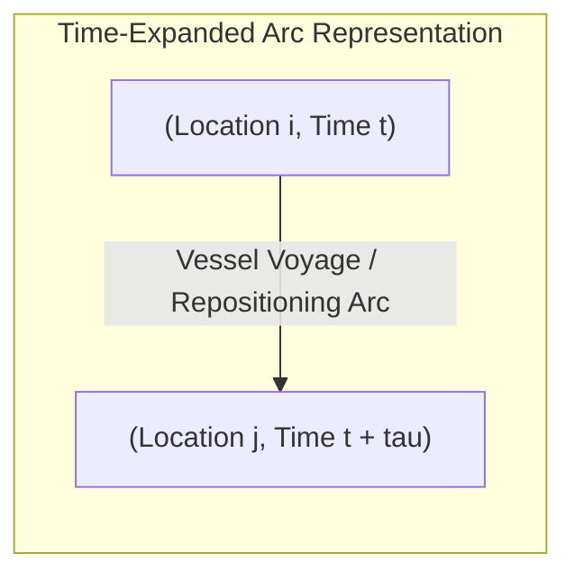
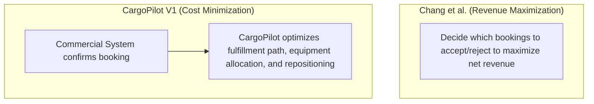
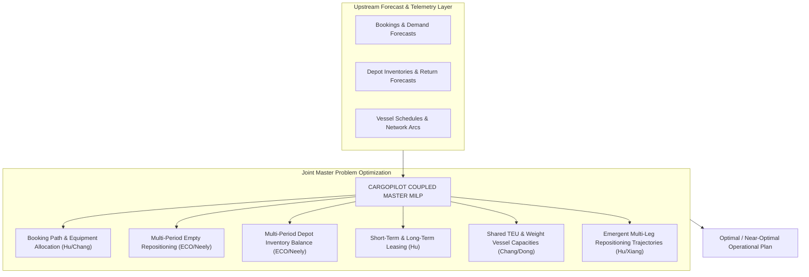

# CargoPilot Optimization — Research Extraction & Mathematical Synthesis

## Primary Literature Sources

| Ref # | Author(s) & Year | Title / Topic | Core Contribution Reused |
| :---: | :--- | :--- | :--- |
| **[1]** | **Epstein et al. (2012)** | *ECO / CSAV Global Container Optimization* | Multi-period, multi-commodity network flow, inventory holding, and safety stock. |
| **[2]** | **Neely (2008)** | *Inventory Policies for Empty Containers (MIT Thesis)* | Detailed conservation equations, loading/unloading binaries, and port inventory policies. |
| **[3]** | **Chang, Lan & Lee (2014/2015)** | *Integrated Slot Allocation + Empty Repositioning* | TEU vs. weight capacity constraints, multi-modal transport, and laden/empty competition. |
| **[4]** | **Dong & Song (2009)** | *Fleet Sizing & Empty Repositioning* | Simulation-based fleet sizing, threshold inventory policies, and laden priority rules. |
| **[5]** | **Hu, Du & Bernardo (2021)** | *Leasing vs. Repositioning under Disruptions* | Path-based routing, short-term vs. long-term leasing, and guide leasing price derivations. |
| **[6]** | **Xiang et al. (2024)** | *Robust Maritime Network Optimization* | Two-stage robust optimization, budgeted uncertainty sets, and candidate-path reduction. |

> [!NOTE]
> No single published paper solves the entire CargoPilot problem. ECO provides the operational multi-period container flow foundation (with detailed equations in Neely 2008), Chang models slot competition, Hu introduces the leasing trade-off and multi-leg paths, and Xiang represents modern robust uncertainty and path pruning.

---

## 1. Core Network Representation

The fundamental state representation across all primary literature is the space-time tensor product:

$$\text{Location} \ (\mathcal{P}) \quad \times \quad \text{Equipment Type} \ (\mathcal{K}) \quad \times \quad \text{Time Period} \ (\mathcal{T}) \quad \times \quad \text{Voyage / Vessel} \ (\mathcal{V})$$



### Emergent Multi-Leg Routing
A time-expanded network allows complex multi-hop trajectories to emerge naturally without hardcoding explicit return routes:

```text
China (W0) ──► USA (W1) ──► Africa (W3) ──► Middle East (W5) ──► China (W7)
```

---

## 2. Mathematical Sets & Indices

| Symbol | Set Name | Operational Meaning |
| :---: | :--- | :--- |
| $i, j \in \mathcal{P}$ | **Locations** | Seaports, inland container depots (ICDs), rail terminals, container yards (CYs). |
| $k \in \mathcal{K}$ | **Container Types** | Distinct equipment commodities: `20GP`, `40GP`, `40HC`, `REEFER`. |
| $t, s \in \mathcal{T}$ | **Time Periods** | Discrete planning buckets (days or weeks). |
| $v \in \mathcal{V}$ | **Voyages** | Specific scheduled vessel legs. |
| $r \in \mathcal{R}$ | **Service Routes** | Liner service loops sharing vessel capacity. |
| $m \in \mathcal{M}$ | **Transport Modes** | Liner vessel, chartered slot, rail, barge, truck drayage. |
| $p \in \text{Path}(i, j)$ | **Candidate Paths** | Sequence of voyage legs (direct, 1 transshipment, 2 transshipments). |

---

## 3. Initial Inventory Formulation

- **Mathematical Symbol:** $I^0_{i, k}$
- **Definition:** Quantity of usable empty containers of type $k$ physically available at location $i$ at start time $t=0$.
- **Key Literature Finding (Neely):** Empty containers of the same equipment class $k$ are interchangeable; tracking individual container serial numbers inside the MIP is unnecessary and computationally intractable.

---

## 4. Empty Container Demand ($D_{i, k, t}$)

- Expected demand for empty containers at location $i$, equipment type $k$, and period $t$ to satisfy outgoing cargo bookings.
- Ingested as a rolling input from upstream commercial forecasts.

---

## 5. Exogenous Container Returns ($R_{i, k, t}$)

- Inflow of empty containers returned by consignees/importers following cargo devanning.
- **Critical Literature Principle (Neely):** Customer returns are strictly an **exogenous stochastic process**, not an optimizer decision variable. The optimizer schedules equipment *given* anticipated returns.

---

## 6. Pipeline / In-Transit State ($G_{i, k, t}$)

- Known inventory already sailing on vessels prior to $t=0$, scheduled to arrive at location $i$ at future period $t$.
- Prevents redundant repositioning orders when incoming shipments are already en route.

---

## 7. Empty Repositioning Flow Variable ($X_{i, j, k, t, s, v}$)

- **Origin:** Epstein et al. (2012) / Neely (2008)
- **Definition:** Number of type-$k$ empty containers dispatched from location $i$ at time $t$, arriving at location $j$ at time $s$, on vessel voyage $v$.
- **Properties:** Explicitly models departure vs. arrival timing ($s = t + \tau_{ijv}$), directly enforcing transit lead times.

---

## 8. Master Inventory Balance Equation

From Neely (2008, Eq. 6.5) and Epstein et al. (2012):

$$I_{i, k, t+1} = I_{i, k, t} + V_{i, k, t} + R_{i, k, t} - D_{i, k, t} + \text{IN}_{i, k, t} - \text{OUT}_{i, k, t} - \text{UP}_{i, k, t} + \text{DOWN}_{i, k, t}$$

Where:
- $V_{i, k, t}$: Locally generated new/leased containers
- $R_{i, k, t}$: Exogenous customer empty returns
- $D_{i, k, t}$: Outbound container stuffing demand
- $\text{IN}_{i, k, t} / \text{OUT}_{i, k, t}$: Inland rail/truck arrivals and departures
- $\text{UP}_{i, k, t}$: Empties loaded onto vessels (leaving shore inventory)
- $\text{DOWN}_{i, k, t}$: Empties discharged from vessels (entering shore inventory)

---

## 9. Loading & Unloading Terminal Dynamics

To prevent simultaneous, illogical loading and unloading on the same vessel call:

$$u_{i, k, t} + v_{i, k, t} \le 1 \quad \forall i, k, t$$

Where $u_{i,k,t}, v_{i,k,t} \in \{0, 1\}$ are binary indicators coupled to physical flow rates via Big-$M$ capacity bounds.

---

## 10. Vessel Slot & Weight Capacity Bounds

Laden cargo and empty repositioning compete directly for finite vessel resources (Chang et al. 2014, Dong & Song 2009):

### TEU Slot Capacity Constraint
$$\sum_{k \in \mathcal{K}} \lambda_k X_{i, j, k, t, s, v}^{\text{empty}} + \sum_{k \in \mathcal{K}} \lambda_k Y_{i, j, k, t, s, v}^{\text{laden}} \le \text{Cap}^{\text{TEU}}_{v}$$

### Deadweight (Weight) Capacity Constraint
$$\sum_{k \in \mathcal{K}} \omega_k^{\text{empty}} X_{i, j, k, t, s, v}^{\text{empty}} + \sum_{k \in \mathcal{K}} \omega_k^{\text{laden}} Y_{i, j, k, t, s, v}^{\text{laden}} \le \text{Cap}^{\text{WT}}_{v}$$

Where $\lambda_k$ is the TEU conversion factor (e.g., $1.0$ for 20ft, $2.0$ for 40ft/40HC) and $\omega_k$ is the respective weight per unit.

---

## 11. Laden Allocation Scope: Chang vs. CargoPilot



> [!IMPORTANT]
> CargoPilot does not decide booking acceptance/pricing. CargoPilot solves operational fulfillment given accepted bookings.

---

## 12. Path-Based Booking Allocation ($y^{\text{laden}}_{p_{ij}, t}$)

From Hu, Du & Bernardo (2021):
- Each booking is fulfilled via a candidate path $p \in \text{Path}(i, j)$:
  - **Direct:** $i \to j$
  - **1 Transshipment:** $i \to \text{Hub}_1 \to j$
  - **2 Transshipments:** $i \to \text{Hub}_1 \to \text{Hub}_2 \to j$

---

## 13. Equipment Sourcing for Bookings: Owned vs. Leased

From Hu et al. (2021), demand along path $p$ is satisfied by splitting equipment sourcing:

$$y^{\text{demand}}_{p, t} = y^{\text{own}}_{p, t} + l^{\text{short}}_{p, t}$$

- $y^{\text{own}}_{p, t}$: Fulfilled using carrier's owned empty inventory.
- $l^{\text{short}}_{p, t}$: Fulfilled using short-term master lease / spot lease container.

---

## 14. Short-Term vs. Long-Term Leasing Mechanisms

| Leasing Mechanism | Variable | Literature Source | Operational Role |
| :--- | :---: | :--- | :--- |
| **Short-Term (Spot / Trip)** | $l^{\text{short}}_{p, t}$ | Hu et al. (2021) | Acquired at origin for a specific booking path; off-hired at destination. |
| **Long-Term (Term Lease)** | $l^{\text{long}}_{i, t}$ | Hu et al. (2021) | Injected into local depot fleet to buffer continuous structural deficits. |

---

## 15. The Guide Leasing Price & Repositioning Trade-Off

Hu et al. prove that the economic threshold for leasing vs. repositioning is dynamic and network-dependent:

$$\text{Guide Lease Price}(i, t) = \text{Marginal Cost of Repositioning to } i - \text{Downstream Opportunity Cost}$$

- **Rule:** If $\text{Actual Lease Rate} < \text{Guide Lease Price}$, the optimizer leases locally.
- **Rule:** If $\text{Actual Lease Rate} > \text{Guide Lease Price}$, the optimizer repositions empties.

```text
Surplus in Region A ──► Deficit in Region B
          │
          ├──► Option 1: Reposition ($800 freight + 3 weeks transit + slot occupied)
          │
          └──► Option 2: Lease in Region B ($450 lease fee + 0 transit lag)
```

---

## 16. Dynamic Safety Stock Formulations

### Baseline Safety Stock (Epstein / ECO 2012)
$$S_{i, k, t} = \max\left(0, \hat{\mu}^D_{i, k, t} + z_\alpha \hat{\sigma}^D_{i, k, t}\right)$$

### Comprehensive Extended Safety Stock
$$S_{i, k, t} = \max\left(0, (\hat{\mu}^D + \hat{\mu}^R) \cdot \tau_{\text{lead}} + z_\alpha \sqrt{\tau_{\text{lead}} (\sigma^D)^2 + \tau_{\text{lead}} (\sigma^R)^2 + (\mu^D)^2 \sigma^2_{\text{vessel}}}\right)$$

Safety stock is dynamically scaled based on:
1. Demand forecast error ($\sigma^D$)
2. Return forecast error ($\sigma^R$)
3. Next vessel arrival lead time ($\tau_{\text{lead}}$)
4. Vessel arrival delay volatility ($\sigma_{\text{vessel}}$)

---

## 17. Multi-Modal Transport Arcs

Supported transportation modes for empty repositioning (Chang 2014, Neely 2008):
- **Liner Vessel:** Dedicated slots on owned fleet
- **Chartered Slot / Feeder:** Leased slots on third-party carrier loops
- **Rail Intermodal:** Inland train moves between ports and dry ports
- **Truck Drayage:** Short-haul depot-to-dock transfers
- **Barge:** River and coastal feeder movements

---

## 18. Container Physical Lifecycle Delays

From Hu et al. (2021):
- $\tau_1$: Lead time from empty pickup at depot to laden stuffing and port gate-in.
- $\tau_2$: Devanning turnaround time from vessel discharge until container is destuffed, cleaned, and returned as usable empty inventory.

```text
Empty Pickup ──[tau_1]──► Port Gate-in ──► Voyage ──► Port Discharge ──[tau_2]──► Usable Empty
```

---

## 19. Modern Two-Stage Robust Formulation

From Xiang et al. (2024):

### Stage 1 (Here-and-Now)
Vessel capacity commitments and long-term fleet allocations.

### Stage 2 (Wait-and-See)
Given realized demand $f_i \in [\bar{f}_i, \bar{f}_i + \hat{f}_i]$ within a budgeted polyhedral uncertainty set:
$$\min_{x} \left( c^{\top} x + \max_{f \in \mathcal{U}} \min_{y} d^{\top} y(f) \right)$$

- Solved via **Column-and-Constraint Generation (CCG)**.
- Adopted as the blueprint for CargoPilot **V2**.

---

## 20. Literature Evaluation & Strategy Filter

| Research Method / Technique | Source Paper | CargoPilot Adoption Status | Rationale |
| :--- | :--- | :---: | :--- |
| **Multi-Period Multi-Commodity MILP** | ECO / Neely | `CORE V1 FOUNDATION` | Proven in commercial operations (CSAV); exact linear representation. |
| **Path-Based Transshipment Flow** | Hu et al. | `CORE V1 FOUNDATION` | Accurately models 1-to-2 transshipment hops and leasing trade-offs. |
| **TEU + Weight Capacity Constraints** | Chang et al. | `CORE V1 FOUNDATION` | Prevents overloading vessels on heavy cargo routes. |
| **Rolling Horizon Optimization** | ECO / Neely | `CORE V1 ARCHITECTURE` | Necessary for dynamic operations in continuously changing networks. |
| **Two-Stage Robust Optimization (CCG)** | Xiang et al. | `PHASE 2 / V2 ROADMAP` | Add after deterministic core is fully validated. |
| **Piecewise-Affine Policy** | Xiang et al. | `PHASE 2 / V2 ROADMAP` | Acceleration technique for large-scale robust models. |
| **Threshold Inventory Heuristic $(D, U)$** | Dong & Song | `BENCHMARK / FALLBACK` | Useful for warm-starting and rule-based fallback policies. |
| **Genetic Algorithms / Metaheuristics** | Dong & Song | `REJECTED FOR CORE` | Fails to guarantee hard linear flow conservation constraints. |
| **Bi-Level Revenue Optimization** | Chang et al. | `REJECTED FOR V1` | Outside CargoPilot V1 scope (commercial booking acceptance is external). |
| **Independent Per-Port Optimizers** | Heuristic Literature | `REJECTED` | Isolated sub-optimization creates severe global shortages. |

---

## 21. Consolidated Master Architecture



---

## 22. Consolidated Decision Variables

| Variable | Indices | Domain | Literature Foundation | Description |
| :--- | :---: | :---: | :--- | :--- |
| $Y^{\text{laden}}_{b, p, t}$ | $b, p, t$ | $\{0, 1\} \text{ or } \mathbb{R}^+$ | Hu et al. (2021) | Booking $b$ assigned to candidate path $p$ departing at period $t$. |
| $Y^{\text{own}}_{b, k, t}$ | $b, k, t$ | $\mathbb{Z}^+ \text{ or } \mathbb{R}^+$ | Hu et al. (2021) | Quantity of owned container type $k$ allocated to booking $b$. |
| $L^{\text{short}}_{b, k, t}$ | $b, k, t$ | $\mathbb{Z}^+ \text{ or } \mathbb{R}^+$ | Hu et al. (2021) | Quantity of short-term leased containers allocated to booking $b$. |
| $L^{\text{long}}_{i, k, t}$ | $i, k, t$ | $\mathbb{Z}^+ \text{ or } \mathbb{R}^+$ | Hu et al. (2021) | Long-term leased containers acquired at location $i$ in period $t$. |
| $X_{i, j, k, t, s, v}$ | $i, j, k, t, s, v$ | $\mathbb{Z}^+ \text{ or } \mathbb{R}^+$ | Epstein / Neely (2012) | Empty containers of type $k$ repositioned from $i$ to $j$ on voyage $v$. |
| $I_{i, k, t}$ | $i, k, t$ | $\mathbb{R}^+$ | Epstein / Neely (2012) | Available empty inventory of type $k$ at location $i$ at end of period $t$. |
| $\text{UP}_{i, k, t}$ | $i, k, t$ | $\mathbb{R}^+$ | Neely (2008) | Empties loaded onto vessels at port $i$ during period $t$. |
| $\text{DOWN}_{i, k, t}$ | $i, k, t$ | $\mathbb{R}^+$ | Neely (2008) | Empties discharged from vessels at port $i$ during period $t$. |
| $S_{b}$ | $b$ | $\mathbb{R}^+$ | Standard MILP Slack | Shortage / unfulfilled demand for booking $b$ (heavily penalized). |
| $B_{b, t}$ | $b, t$ | $\mathbb{R}^+$ | Chang et al. (2015) | Backlogged / delayed booking units carrying contractual per-period penalty. |

---

## 23. Complete Constraint Library (30 Core Rules)

1. **Multi-Period Inventory Conservation:** $I_{i,k,t+1} = I_{i,k,t} + \text{Inflows} - \text{Outflows}$
2. **Empty Flow Conservation across Network Nodes**
3. **Laden Cargo Flow Conservation across Path Arcs**
4. **Booking Demand Satisfaction:** $\sum_p Y^{\text{laden}}_{b, p} + S_b = Q_b$
5. **Equipment Sourcing Balance:** $Y^{\text{laden}} = Y^{\text{own}} + L^{\text{short}}$
6. **Initial Inventory Bounds:** $I_{i, k, 0} = \text{Inv}^0_{i, k}$
7. **Empty Repositioning Flow Bounds**
8. **Vessel Slot (TEU) Capacity Bounds**
9. **Vessel Deadweight (Weight) Capacity Bounds**
10. **Laden + Empty Shared Capacity Coupling**
11. **Voyage Departure and Arrival Lead-Time Equations**
12. **Repositioning Space-Time Arc Transit Times**
13. **Terminal Loading Lead-Time Windows**
14. **Terminal Discharge / Unloading Lead-Time Windows**
15. **Customer Devanning & Empty Return Turnaround ($\tau_2$)**
16. **Dynamic Safety Stock Lower Bounds:** $I_{i, k, t} \ge \text{SS}_{i, k, t} - \text{Slack}$
17. **Short-Term Leasing Supply Availability Limits**
18. **Long-Term Leasing Master Contract Caps**
19. **Inventory Non-Negativity:** $I_{i, k, t} \ge 0$
20. **Network Arc Flow Non-Negativity:** $X, Y \ge 0$
21. **Booking Backlog Conservation Equations**
22. **Demand Shortage Penalty Slack Equations**
23. **Maximum Allowable Delivery Delay Constraints**
24. **Path Feasibility & Graph Connectivity**
25. **Vessel Leg Availability Constraints**
26. **Terminal Simultaneous Loading/Unloading Logic:** $u + v \le 1$
27. **Equipment Commodity Compatibility (Non-Substitution)**
28. **Multi-Modal Mode Selection Bounds**
29. **Terminal Storage Physical Capacity Limits**
30. **Configurable Carrier-Specific Operational Restrictions**

---

## 24. Research-Backed Synthesis Map

```text
                              CARGOPILOT
                                  │
       ┌──────────────────────────┼──────────────────────────┐
       ▼                          ▼                          ▼
Bookings & Paths          Empty Container Flows      Inventory Dynamics
 (Chang 2014, Hu 2021)   (Epstein 2012, Neely 2008)  (Epstein 2012, Neely 2008)
       │                          │                          │
       └──────────────────────────┼──────────────────────────┘
                                  │
                                  ▼
                     Leasing vs. Repositioning
                        (Hu et al. 2021)
                                  │
                                  ▼
                     Shared Capacity Allocation
                    (Chang 2014, Dong 2009, ECO)
                                  │
                                  ▼
                   Emergent Multi-Leg Trajectories
                     (Hu 2021, Xiang 2024)
                                  │
                                  ▼
                      Future Strategic Planning
                    (Dong 2009, Epstein 2012)
```
